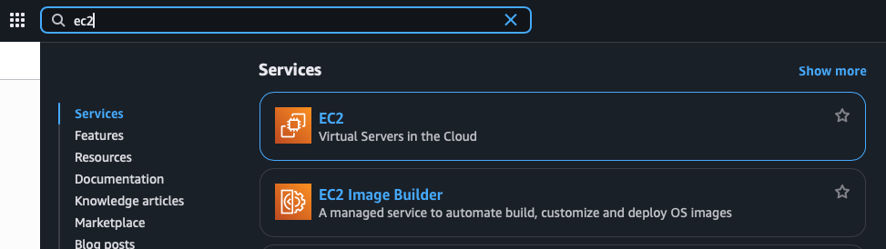
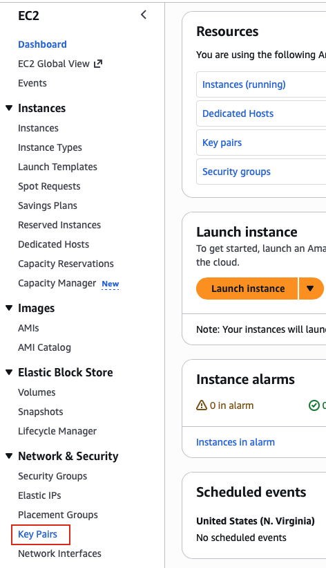
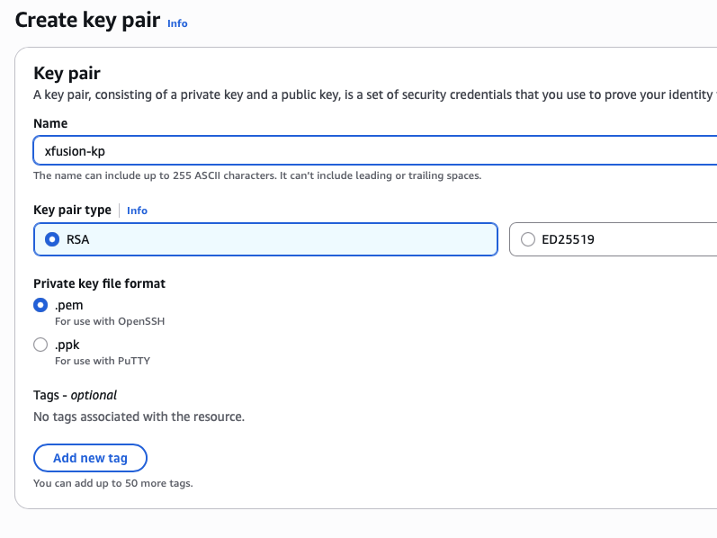
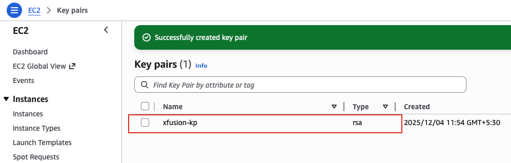

## Task: Create Key Pair
The Nautilus DevOps team is strategizing the migration of a portion of their infrastructure to the AWS cloud. Recognizing the scale of this undertaking, they have opted to approach the migration in incremental steps rather than as a single massive transition. To achieve this, they have segmented large tasks into smaller, more manageable units. This granular approach enables the team to execute the migration in gradual phases, ensuring smoother implementation and minimizing disruption to ongoing operations. By breaking down the migration into smaller tasks, the Nautilus DevOps team can systematically progress through each stage, allowing for better control, risk mitigation, and optimization of resources throughout the migration process.

For this task, create a key pair with the following requirements:

- Name of the `key pair` should be `xfusion-kp`.
- Key pair `type` must be `rsa`

---

## Solution

### **Step 1: Log in to AWS Management Console** 
Sign in with the credentials provided.

### **Step 2: Navigate to EC2 Service**
- In the top search bar, type **EC2**.  
- Select **EC2** from the services list.  
- This will take you to the EC2 Dashboard.  

### **Step 3: Access Key Pairs Section**
- In the left navigation panel, scroll down to the **Network & Security** section.
- Click on **Key Pairs**.  

### **Step 4: Create New Key Pair**
- Click the **Create key pair**.

### **Step 5: Configure Key Pair Settings**
**Key Pair Configuration:**

- **Name:** `xfusion-kp`  
- **Key pair type:** Select **RSA**  
- **Private key file format:** Choose your preferred format:
  - **.pem** - For use with OpenSSH (Linux/Mac/Windows with OpenSSH)
  - **.ppk** - For use with PuTTY (Windows)

**IMPORTANT NOTE:** For most Linux/Mac environments and modern Windows systems with OpenSSH, select the `.pem` format. If you're using PuTTY on Windows, select the `.ppk` format.

### **Step 6: Create Key Pair**
- Review all settings:
  - Name: `xfusion-kp`
  - Type: `RSA`
  - Format: `.pem` or `.ppk`
- Click **Create key pair**

### **Step 7: Download Private Key**
**CRITICAL STEP:** The private key file will automatically download to your computer. This is the **ONLY time** you can download this file.

- The file will be named `xfusion-kp.pem` (or `xfusion-kp.ppk`)
- **Save this file in a secure location**
- **Do NOT share this file** or commit it to version control

### **Step 8: Verify Key Pair Creation**
- You should now see `xfusion-kp` listed in the Key Pairs dashboard
- Verify the details:
  - **Name:** `xfusion-kp`
  - **Type:** `RSA`
  - **Fingerprint:** A unique identifier will be displayed

