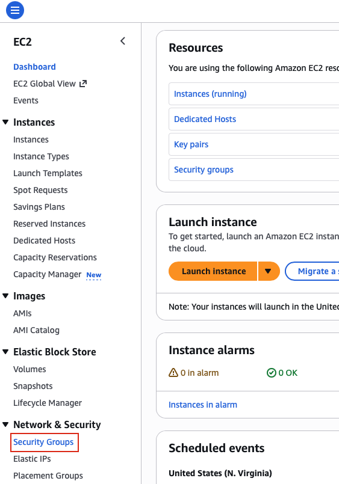
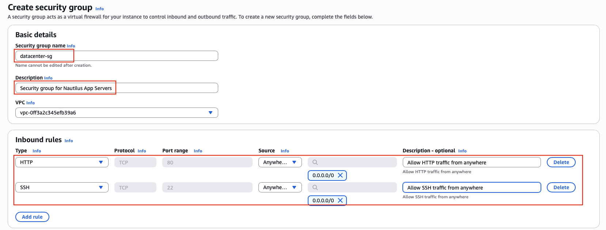
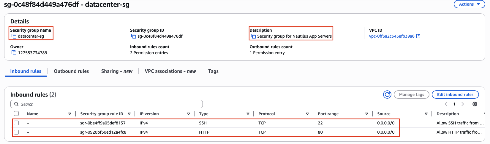

## Task: Create Security Group
The Nautilus DevOps team is strategizing the migration of a portion of their infrastructure to the AWS cloud. Recognizing the scale of this undertaking, they have opted to approach the migration in incremental steps rather than as a single massive transition. To achieve this, they have segmented large tasks into smaller, more manageable units. This granular approach enables the team to execute the migration in gradual phases, ensuring smoother implementation and minimizing disruption to ongoing operations. By breaking down the migration into smaller tasks, the Nautilus DevOps team can systematically progress through each stage, allowing for better control, risk mitigation, and optimization of resources throughout the migration process.

For this task, create a security group under default VPC with the following requirements:

- Name of the security group is `datacenter-sg`.
- The description must be `Security group for Nautilus App Servers`
- Add the inbound rule of type `HTTP`, with port range of `80`. Enter the source CIDR range of `0.0.0.0/0`.
- Add another inbound rule of type `SSH`, with port range of `22`. Enter the source CIDR range of `0.0.0.0/0`.

---

## Solution

### **Step 1: Log in to AWS Management Console**
Sign in with the credentials provided.

### **Step 2: Navigate to EC2 Service**
- In the top search bar, type **EC2**.  
- Select **EC2** from the services list.  
- This will take you to the EC2 Dashboard.

### **Step 3: Access Security Groups Section**
- In the left navigation panel, scroll down to the **Network & Security** section.
- Click on **Security Groups**.

### **Step 4: Create New Security Group**
- Click the **Create security group** button in the top right corner.

### **Step 5: Configure Basic Settings**
**Basic Details:**

- **Security group name:** `datacenter-sg`  
- **Description:** `Security group for Nautilus App Servers`  
- **VPC:** Select the **default VPC** from the dropdown (it will be labeled as "default")

**IMPORTANT NOTE:** The default VPC is automatically selected in most cases, but verify that you're using the default VPC and not creating the security group in a custom VPC.

### **Step 6: Configure Inbound Rules - HTTP**
In the **Inbound rules** section:

- Click **Add rule**

**HTTP Rule Configuration:**
- **Type:** Select **HTTP** from the dropdown  
- **Protocol:** TCP (auto-populated)
- **Port range:** 80 (auto-populated)
- **Source:** Select **Custom** from the dropdown
- **CIDR block:** Enter `0.0.0.0/0`
- **Description:** `Allow HTTP traffic from anywhere` (optional but recommended)

### **Step 7: Configure Inbound Rules - SSH**
Continue adding the second inbound rule:

- Click **Add rule** again

**SSH Rule Configuration:**
- **Type:** Select **SSH** from the dropdown  
- **Protocol:** TCP (auto-populated)
- **Port range:** 22 (auto-populated)
- **Source:** Select **Custom** from the dropdown
- **CIDR block:** Enter `0.0.0.0/0`
- **Description:** `Allow SSH access from anywhere` (optional but recommended)

### **Step 8: Create Security Group**
- Click **Create security group** 

### **Step 9: Verify Security Group Creation**
Upon successful creation, you will see a success message and be redirected to the security group details page.

Verify the details:
- **Security group name:** `datacenter-sg`
- **Description:** `Security group for Nautilus App Servers`
- **VPC ID:** Your default VPC ID

