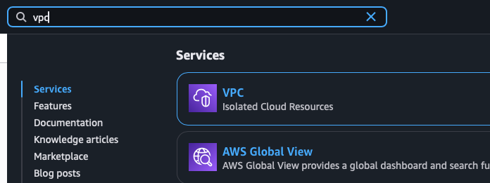
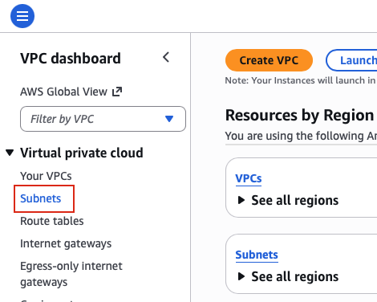
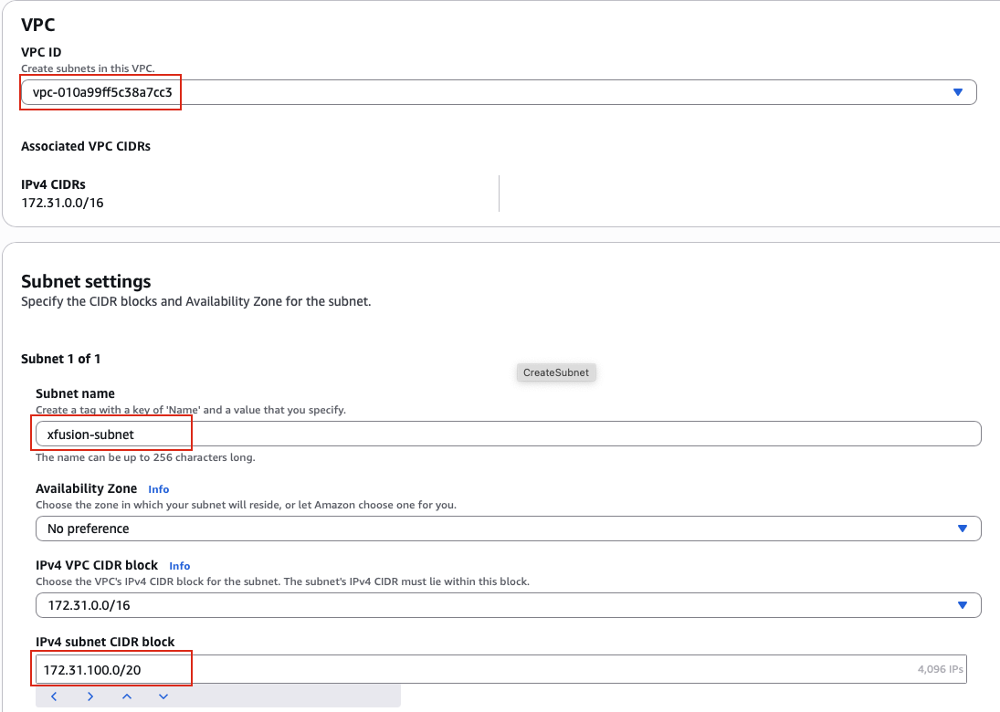
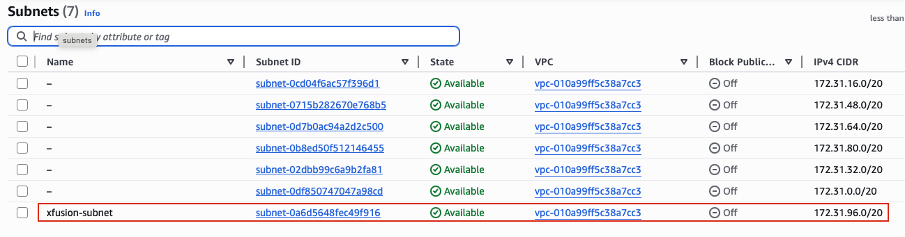

## Task: Create Subnet
The Nautilus DevOps team is strategizing the migration of a portion of their infrastructure to the AWS cloud. Recognizing the scale of this undertaking, they have opted to approach the migration in incremental steps rather than as a single massive transition.

For this task, create one subnet named `xfusion-subnet` under default VPC.

---

## Solution

### **Step 1: Log in to AWS Management Console**
Sign in with the credentials provided.

### **Step 2: Navigate to VPC Service**
- In the top search bar, type **VPC**.  
- Select **VPC** from the services list.  
- This will take you to the VPC Dashboard.  

### **Step 3: Access Subnets Section**
- In the left navigation panel, locate the **Virtual private cloud** section.
- Click on **Subnets**.
- You will see a list of existing subnets in your AWS account.  

### **Step 4: Create New Subnet**
- Click the **Create subnet** button in the top right corner.

### **Step 5: Select VPC**
**VPC Selection:**

- **VPC ID:** Select your **default VPC** from the dropdown menu
- The default VPC will be labeled as "default"

**IMPORTANT NOTE:** Make sure you select the default VPC, not a custom VPC. The default VPC is automatically created in each AWS region when your account is set up.

### **Step 6: Configure Subnet Settings**
**Subnet Settings:**

- **Subnet name:** `xfusion-subnet`  
- **IPv4 CIDR block:** Enter a valid CIDR block within your VPC's address range
  - The default VPC typically uses `172.31.0.0/16`
  - Example subnet CIDR blocks you can use:
    - `172.31.100.0/20` 

**IMPORTANT** The CIDR block you choose must:
- Be within the VPC's CIDR range (e.g., 172.31.0.0/16 for default VPC)
- Not overlap with existing subnets
- Follow AWS subnet sizing rules (between /16 and /28)

### **Step 7: Create Subnet**
- Review all the configuration details
- Click **Create subnet** at the bottom of the page

### **Step 8: Verify Subnet Creation**
Upon successful creation, you will see a success message.

- The page will redirect to the Subnets list
- Locate `xfusion-subnet` in the list
- Verify the subnet details:
  - **Name:** `xfusion-subnet`
  - **State:** `Available`
  - **VPC:** Your default VPC ID
  - **IPv4 CIDR:** The CIDR block you specified

