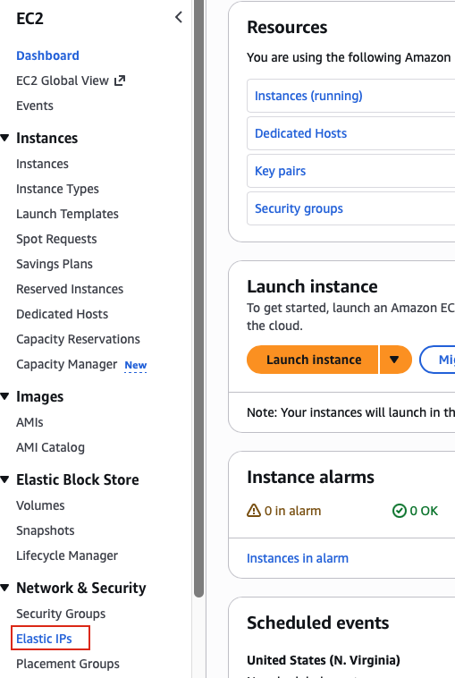
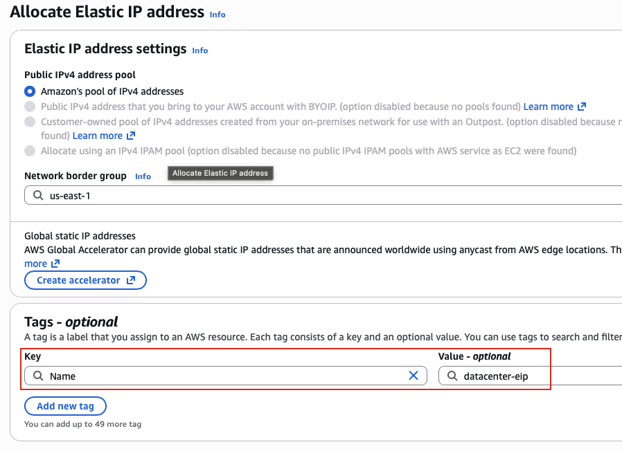
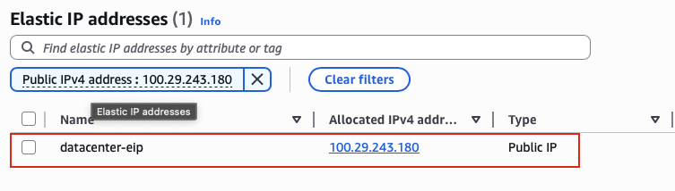

## Task: Allocate Elastic IP
The Nautilus DevOps team is strategizing the migration of a portion of their infrastructure to the AWS cloud. Recognizing the scale of this undertaking, they have opted to approach the migration in incremental steps rather than as a single massive transition. To achieve this, they have segmented large tasks into smaller, more manageable units. This granular approach enables the team to execute the migration in gradual phases, ensuring smoother implementation and minimizing disruption to ongoing operations. By breaking down the migration into smaller tasks, the Nautilus DevOps team can systematically progress through each stage, allowing for better control, risk mitigation, and optimization of resources throughout the migration process.

For this task, allocate an `Elastic IP` address, name it as `datacenter-eip`.

---

## Solution

### **Step 1: Log in to AWS Management Console**
Sign in with the credentials provided.

### **Step 2: Navigate to EC2 Service**
- In the top search bar, type **EC2**.  
- Select **EC2** from the services list.  
- This will take you to the EC2 Dashboard.

### **Step 3: Access Elastic IPs Section**
- In the left navigation panel, scroll down to the **Network & Security** section.
- Click on **Elastic IPs**.
- You will see a list of existing Elastic IPs in your AWS account (if any).  

### **Step 4: Allocate Elastic IP Address**
- Click **Allocate Elastic IP address**
- Click **Add new tag** 
  - **Key:** `Name`  
  - **Value:** `datacenter-eip`
- Click **Allocate**  

### **Step 5: View Elastic IP Details**
In the Elastic IPs list, you should now see your newly allocated Elastic IP:
- **Name:** `datacenter-eip`
- **Allocated IPv4 address:** A public IP address (e.g., 100.29.243.180)
- **Type:** Public IP  

