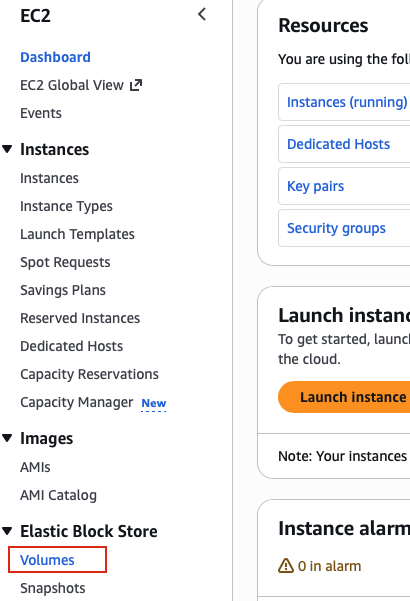
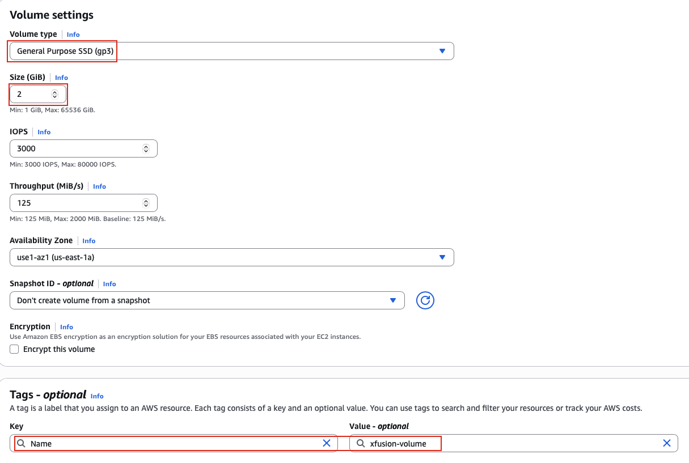
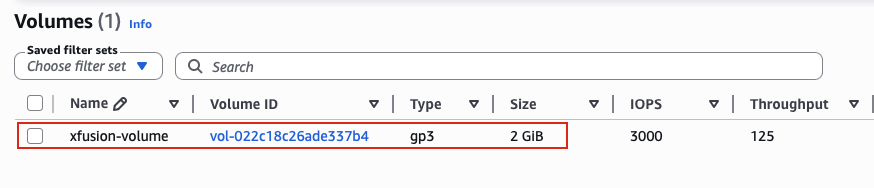

## Task: Create GP3 Volume
The Nautilus DevOps team is strategizing the migration of a portion of their infrastructure to the AWS cloud. Recognizing the scale of this undertaking, they have opted to approach the migration in incremental steps rather than as a single massive transition. To achieve this, they have segmented large tasks into smaller, more manageable units. This granular approach enables the team to execute the migration in gradual phases, ensuring smoother implementation and minimizing disruption to ongoing operations. By breaking down the migration into smaller tasks, the Nautilus DevOps team can systematically progress through each stage, allowing for better control, risk mitigation, and optimization of resources throughout the migration process.

Create a volume with the following requirements:

1. Name of the volume should be `xfusion-volume`.
2. Volume `type` must be `gp3`.
3. Volume `size` must be `2 GiB`.

---

## Solution

### **Step 1: Log in to AWS Management Console**
Sign in with the credentials provided.

### **Step 2: Navigate to EC2 Service**
- In the top search bar, type **EC2**.  
- Select **EC2** from the services list.  
- This will take you to the EC2 Dashboard.

### **Step 3: Access Volumes Section**
- In the left navigation panel, scroll down to the **Elastic Block Store** section.
- Click on **Volumes**.
- You will see a list of existing EBS volumes in your AWS account (if any).  

### **Step 4: Create New Volume**
- Click the **Create volume** button in the top right corner.

### **Step 5: Configure Volume Type**
- **Volume type:** Select **General Purpose SSD (gp3)** from the dropdown
- **Size (GiB):** Enter `2`
- Leave other settings as default
- Click **Add tag**
  - **Key:** `Name`  
  - **Value:** `xfusion-volume`
- Click **Create volume**  

### **Step 6: View Volume in Volumes List**
In the Volumes list, locate your newly created volume:
- **Name:** `xfusion-volume`
- **Volume ID:** A unique identifier (e.g., vol-022c18c26ade337b4)
- **Size:** 2 GiB
- **Volume type:** gp3  

Make sure the **Volume state** is **Available** before submitting the task.
