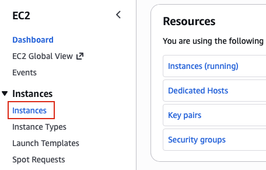
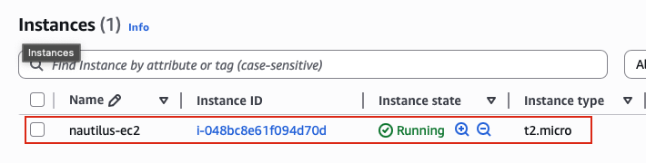

## Task: Launch EC2 Instance
The Nautilus DevOps team is strategizing the migration of a portion of their infrastructure to the AWS cloud. Recognizing the scale of this undertaking, they have opted to approach the migration in incremental steps rather than as a single massive transition. To achieve this, they have segmented large tasks into smaller, more manageable units. This granular approach enables the team to execute the migration in gradual phases, ensuring smoother implementation and minimizing disruption to ongoing operations. By breaking down the migration into smaller tasks, the Nautilus DevOps team can systematically progress through each stage, allowing for better control, risk mitigation, and optimization of resources throughout the migration process.

For this task, create an EC2 instance with following requirements:

1. The name of the instance must be `nautilus-ec2`.
2. You can use the `Amazon Linux` AMI to launch this instance.
3. The Instance type must be `t2.micro`.
4. Create a new RSA key pair named `nautilus-kp`.
5. Attach the default (available by default) security group.

---

## Solution

### **Step 1: Log in to AWS Management Console**
Sign in with the credentials provided.

### **Step 2: Navigate to EC2 Service**
- In the top search bar, type **EC2**.  
- Select **EC2** from the services list.  
- This will take you to the EC2 Dashboard.

### **Step 3: Launch EC2 Instance**
- In the EC2 Dashboard, locate the **Instances** section
- Click on **Instances** in the left navigation panel
- Click the **Launch instances**  

### **Step 4: Configure Instance Name**
- **Name:** `nautilus-ec2`
- In the **Quick Start** section, select **Amazon Linux**
- In the Instance type dropdown, search for or select **t2.micro**
- **Key pair configuration:**
  - Click **Create new key pair**
    - **Key pair name:** `nautilus-kp`
    - **Key pair type:** Select **RSA**
    - **Private key file format:** Select **.pem**
    - Click **Create key pair**
- In the **Network settings** section
  - **Firewall (security groups):** Select **Select existing security group**
    - **Common security groups:** Select **default**
- Leave other options as default and click **Launch instance**

### **Step 5: Verify Instance Launch**
Upon successful launch, you will see a success message:
- **Success message:** "Successfully initiated launch of instance (i-xxxxxxxxxxxxxxxxx)"
- Click **View all instances** to go to the Instances dashboard  

