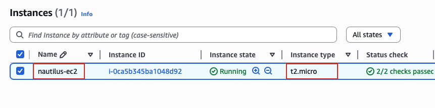
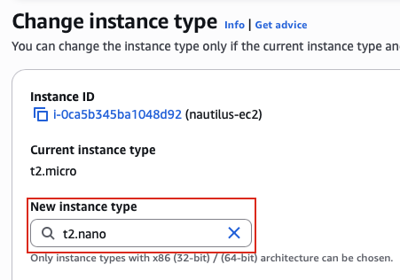
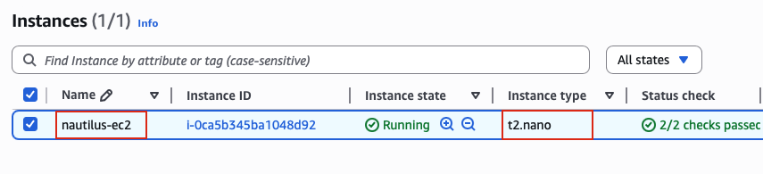

## Task: Change EC2 Instance Type
During the migration process, the Nautilus DevOps team created several EC2 instances in different regions. They are currently in the process of identifying the correct resources and utilization and are making continuous changes to ensure optimal resource utilization. Recently, they discovered that one of the EC2 instances was underutilized, prompting them to decide to change the instance type. Please make sure the `Status check` is completed (if its still in `Initializing` state) before making any changes to the instance.

1. Change the instance type from `t2.micro` to `t2.nano` for `nautilus-ec2` instance.
2. Make sure the ec2 instance `nautilus-ec2` is in `running` state after the change.

---

## Solution

### **Step 1: Log in to AWS Management Console**
Sign in with the credentials provided.

### **Step 2: Navigate to EC2 Service**
- In the top search bar, type **EC2**.  
- Select **EC2** from the services list.  
- This will take you to the EC2 Dashboard.

### **Step 3: Navigate to Instances**
- In the left navigation panel, click on **Instances**
- You will see a list of all EC2 instances in the current region

### **Step 4: Locate the nautilus-ec2 Instance**
- Find the instance named `nautilus-ec2` in the instances list
- You can use the search bar to filter by name
- Click on the instance to select it (checkbox on the left)  

### **Step 5: Stop the Instance**
To change the instance type, you must first stop the instance.

**IMPORTANT:** You cannot change the instance type while the instance is running.
- Select the `nautilus-ec2` instance (checkbox checked)
- Click **Instance state** dropdown (top right)
- Select **Stop instance** 

### **Step 6: Wait for Instance to Stop**
Monitor the instance state:
- **Instance State:** `Stopping` → `Stopped`
- This process typically takes 30-60 seconds
- Wait until the instance state shows **Stopped** before proceeding

### **Step 7: Access Change Instance Type Option**
With the instance still selected:
- Click **Actions** dropdown (top right)
- Navigate to **Instance settings**
- Select **Change instance type**

### **Step 8: Select New Instance Type**
The Change Instance Type dialog will appear:

**Current configuration:**
- **Current instance type:** t2.micro

**New configuration:**
- **New instance type:** Click the dropdown or search box
  - Search for or scroll to find **t2.nano**
  - Select **t2.nano**  
- Click **Change instance type**  

### **Step 9: Start the Instance**
Now that the instance type has been changed, start the instance:
- Select the `nautilus-ec2` instance (checkbox checked)
- Click **Instance state** dropdown (top right)
- Select **Start instance**

### **Step 10: Verify Instance is Running**
Once the instance has fully started:
- **Instance State:** `Running` 
- **Status Checks:** `2/2 checks passed` 
- **Public IPv4 address:** New IP assigned (unless using Elastic IP)
- **Instance type:** t2.nano  

