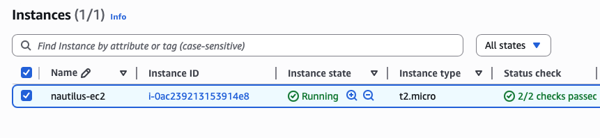
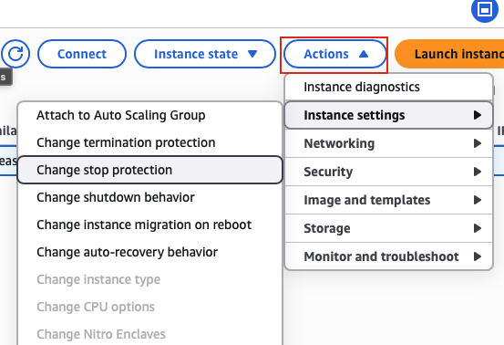
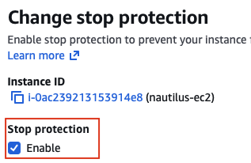

## Task: Enabling Stop Protection for EC2 Instance
As part of the migration, there were some components added to the AWS account. Team created one of the EC2 instances where they need to make some changes now.

There is an EC2 instance named `nautilus-ec2` under `us-east-1` region, enable the `stop` protection for this instance.

---

## Solution

### **Step 1: Log in to AWS Management Console**
Sign in with the credentials provided.

### **Step 2: Navigate to EC2 Service**
- In the top search bar, type **EC2**.  
- Select **EC2** from the services list.  
- This will take you to the EC2 Dashboard.

### **Step 3: Navigate to Instances**
- In the left navigation panel, click on **Instances**
- You will see a list of all EC2 instances  

### **Step 4: Locate the nautilus-ec2 Instance**
- Find the instance named `nautilus-ec2` in the instances list
- You can use the search/filter bar to quickly find it:
- Click on the instance name to select it (checkbox on the left)  

### **Step 5: Access Instance Settings**
With the `nautilus-ec2` instance selected:
- Click the **Actions** dropdown button (top right)
- Navigate to **Instance settings**
- Select **Change stop protection**  

### **Step 6: Enable Stop Protection**
In the Change stop protection dialog:
- Locate the **Enable** checkbox
- Check the box next to **Enable**
- You'll see a message explaining what stop protection does  
- Click **Save** at the bottom of the dialog  

### **Step 7: Verify Success Message**
After saving, you should see a success message:
- **Success banner:** "Successfully updated stop protection for instance i-xxxxxxxxxxxxxxxxx"
