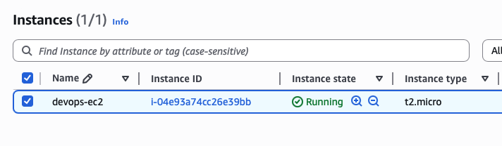
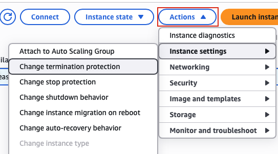
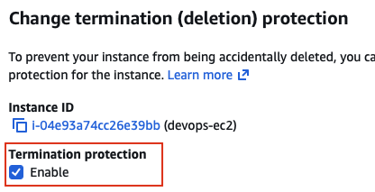

## Task: Enable Termination Protection for EC2 Instance
As part of the migration, there were some components created under the AWS account. The Nautilus DevOps team created one EC2 instance where they forgot to enable the termination protection which is needed for this instance.

An instance named `devops-ec2` already exists in `us-east-1` region. Enable `termination protection` for the same.

---

## Solution

### **Step 1: Log in to AWS Management Console**
Sign in with the credentials provided.

### **Step 2: Navigate to EC2 Service**
- In the top search bar, type **EC2**.  
- Select **EC2** from the services list.  
- This will take you to the EC2 Dashboard.

### **Step 3: Navigate to Instances**
- In the left navigation panel, click on **Instances**
- You will see a list of all EC2 instances  

### **Step 4: Locate the devops-ec2 Instance**
- Find the instance named `devops-ec2` in the instances list
- You can use the search/filter bar to quickly find it:
- Click on the instance name to select it (checkbox on the left)  

### **Step 5: Access Instance Settings**
With the `devops-ec2` instance selected:
- Click the **Actions** dropdown button (top right)
- Navigate to **Instance settings**
- Select **Change termination protection**  

### **Step 6: Enable Termination Protection**
In the Change termination protection dialog:
- Locate the **Enable** checkbox
- Check the box next to **Enable**
- You'll see a message explaining what termination protection does  
- Click **Save** at the bottom of the dialog  

### **Step 7: Verify Success Message**
After saving, you should see a success message:
- **Success banner:** "Successfully updated termiantion protection for instance i-xxxxxxxxxxxxxxxxx"
