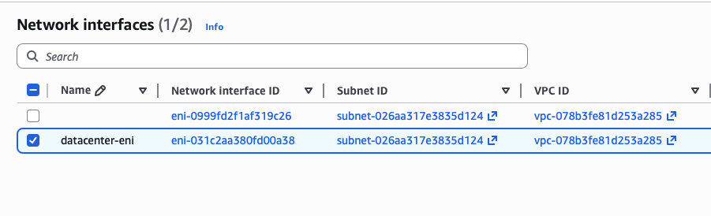
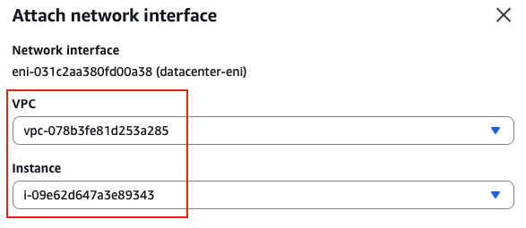

## Task: Attach Elastic Network Interface to EC2 Instance
The Nautilus DevOps team has been creating a couple of services on AWS cloud. They have been breaking down the migration into smaller tasks, allowing for better control, risk mitigation, and optimization of resources throughout the migration process. Recently they came up with requirements mentioned below.

An instance named `datacenter-ec2` and an elastic network interface named `datacenter-eni` already exists in `us-east-1` region.

- Attach the `datacenter-eni` network interface to the `datacenter-ec2` instance.
- Make sure status is `attached` before submitting the task.
Please make sure instance initialisation has been completed before submitting this task.

---

## Solution

### **Step 1: Log in to AWS Management Console**
Sign in with the credentials provided.

### **Step 2: Navigate to EC2 Service**
- In the top search bar, type **EC2**.  
- Select **EC2** from the services list.  
- This will take you to the EC2 Dashboard.

### **Step 3: Check Instance Initialization Status**
**CRITICAL PREREQUISITE:** Before attaching the ENI, verify the instance is fully initialized.
- Click on **Instances** in the left navigation panel
- Locate the `datacenter-ec2` instance
- Check the following:
  - **Instance State:** Must be `Running` (green)
  - **Status Checks:** Must show `2/2 checks passed` (not "Initializing")
  - **Instance initialization:** Must be complete  

**IMPORTANT:** If status checks show "Initializing", WAIT until they show "2/2 checks passed" before proceeding. 

**Why This Matters:**
- Attaching an ENI during initialization can cause issues
- The instance must be fully operational
- Network services must be running
- Status checks verify the instance is ready

### **Step 4: Navigate to Network Interfaces**
- In the left navigation panel, scroll down to the **Network & Security** section
- Click on **Network Interfaces**
- You will see a list of all ENIs (Elastic Network Interfaces) in us-east-1

### **Step 5: Locate the datacenter-eni Network Interface**
- Find the network interface named `datacenter-eni` in the list
- You can use the search/filter bar to quickly find it:
  - Type `datacenter-eni` in the search box
  - Or filter by Name tag or Description
- Click on the ENI to select it (checkbox on the left)  

### **Step 6: Initiate ENI Attachment**
With the `datacenter-eni` network interface selected:
- Click the **Actions** dropdown button (top right)
- Select **Attach**  

### **Step 7: Configure Attachment Settings**
The "Attach network interface" dialog will appear:
**Instance field:**
- Click on the **Instance** dropdown
- Search for or select `datacenter-ec2` from the list  
- Click **Attach**  

**IMPORTANT:** Only instances in the same Availability Zone will appear in the dropdown.
