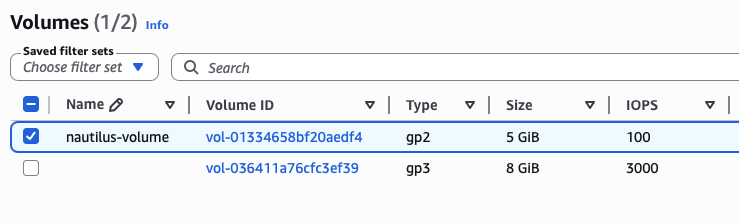
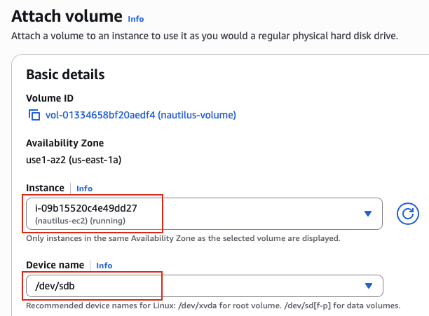
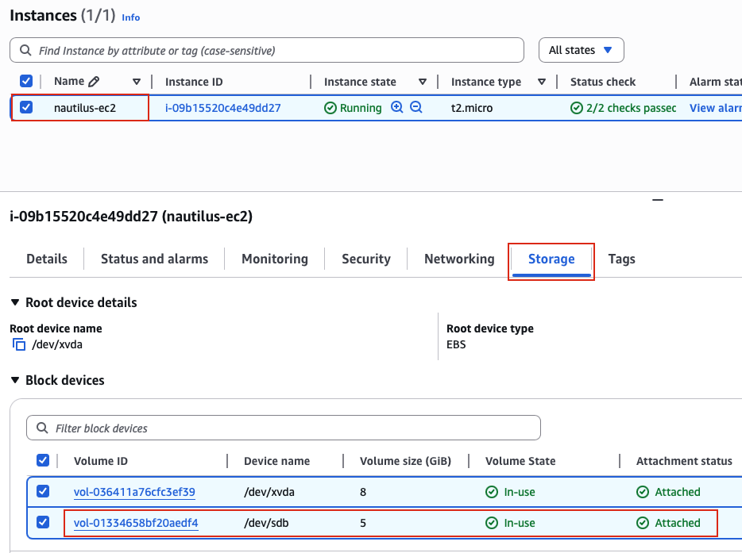

## Task: Attach Volume to EC2 Instance
The Nautilus DevOps team has been creating a couple of services on AWS cloud. They have been breaking down the migration into smaller tasks, allowing for better control, risk mitigation, and optimization of resources throughout the migration process. Recently they came up with requirements mentioned below.

An instance named `nautilus-ec2` and a volume named `nautilus-volume` already exists in `us-east-1` region. Attach the n`autilus-volume` volume to the `nautilus-ec2` instance, make sure to set the device name to `/dev/sdb` while attaching the volume.

---

## Solution

### **Step 1: Log in to AWS Management Console**
Sign in with the credentials provided.

### **Step 2: Navigate to Volumes**
- In the left navigation panel, scroll down to the **Elastic Block Store** section
- Click on **Volumes**
- You will see a list of all EBS volumes in the **us-east-1** region

### **Step 3: Locate the nautilus-volume**
- Find the volume named `nautilus-volume` in the list
- You can use the search/filter bar to quickly find it:
  - Type `nautilus-volume` in the search box
  - Or filter by Name tag
- Click on the volume to select it (checkbox on the left)  

### **Step 4: Initiate Volume Attachment**
With the `nautilus-volume` selected:
- Click the **Actions** dropdown button (top right)
- Select **Attach volume**  

### **Step 5: Configure Attachment Settings**
The "Attach volume" dialog will appear with configuration options:  
**Instance field:**
- Click on the **Instance** dropdown
- Search for or select `nautilus-ec2` from the list

**Device name field:**
- **Device:** Enter `/dev/sdb` exactly as specified  
- Click **Attach volume**  

**IMPORTANT:** Only instances in the same Availability Zone will appear in the dropdown.

### **Step 6: Verify from Instance View**
Navigate to the EC2 instance to verify from the instance side:
- Click on **Instances** in the left navigation panel
- Select or click on the `nautilus-ec2` instance
- Click on the **Storage** tab
- Locate the **Block devices** section

You should now see TWO volumes:
1. **Root volume:** The original boot volume
2. **Data volume:** The nautilus-volume you just attached (/dev/sdb)  

