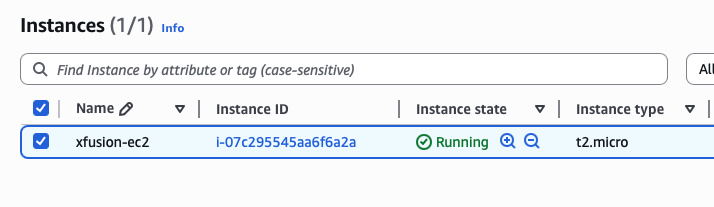
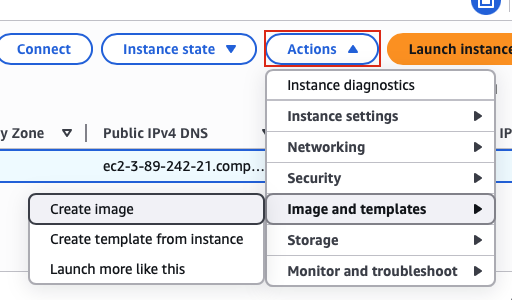
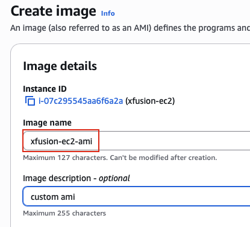
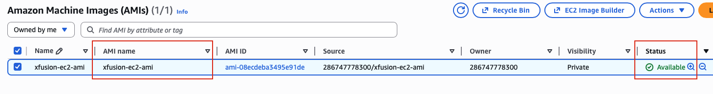

## Task: Creating an AMI from an Existing EC2 Instance
The Nautilus DevOps team is strategizing the migration of a portion of their infrastructure to the AWS cloud. Recognizing the scale of this undertaking, they have opted to approach the migration in incremental steps rather than as a single massive transition. To achieve this, they have segmented large tasks into smaller, more manageable units. This granular approach enables the team to execute the migration in gradual phases, ensuring smoother implementation and minimizing disruption to ongoing operations. By breaking down the migration into smaller tasks, the Nautilus DevOps team can systematically progress through each stage, allowing for better control, risk mitigation, and optimization of resources throughout the migration process.

For this task, create an AMI from an existing EC2 instance named `xfusion-ec2` with the following requirement:

- Name of the AMI should be `xfusion-ec2-ami`, make sure AMI is in `available` state.

---

## Solution

### **Step 1: Log in to AWS Management Console**
Sign in with the credentials provided.

### **Step 2: Navigate to EC2 Service**
- In the top search bar, type **EC2**.  
- Select **EC2** from the services list.  
- This will take you to the EC2 Dashboard.

### **Step 3: Navigate to Instances**
- In the left navigation panel, click on **Instances**
- You will see a list of all EC2 instances in the current region  

### **Step 4: Locate the xfusion-ec2 Instance**
- Find the instance named `xfusion-ec2` in the instances list
- You can use the search/filter bar to quickly find it:
  - Type `xfusion-ec2` in the search box
  - Or filter by Name tag
- Click on the instance name to select it (checkbox on the left)  

### **Step 5: Review Instance State**
Before creating an AMI, check the instance state:
- **Running:** You can create an AMI from a running instance (recommended to stop first for consistency)
- **Stopped:** Ideal state for creating AMI (ensures data consistency)
- **Stopping/Pending:** Wait until state stabilizes

### **Step 6: Initiate AMI Creation**
With the `xfusion-ec2` instance selected:
- Click the **Actions** dropdown button (top right)
- Navigate to **Image and templates**
- Select **Create image**  

### **Step 7: Configure AMI Details - Image Name**
The "Create image" dialog will appear with configuration options:
- **Image name:** `xfusion-ec2-ami`  
- Add a meaningful description (optional but recommended)  

**Tags section:**
- Click **Add tag** to add metadata tags (optional)
- **Key:** `Name`
- **Value:** `xfusion-ec2-ami`  

### **Step 8: Create the AMI**
- Review all the configuration details one final time
- Verify the AMI name is exactly `xfusion-ec2-ami`
- Click **Create image** at the bottom of the dialog  

### **Step 9: Navigate to AMIs Section**
To verify and monitor the AMI creation:
- In the left navigation panel, under **Images** section
- Click on **AMIs**
- You will see a list of all AMIs in your account for the current region  
- Submit the task once the AMI **Status** becomes **Available**   

