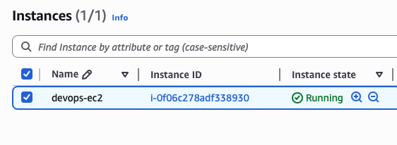
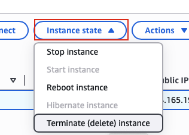
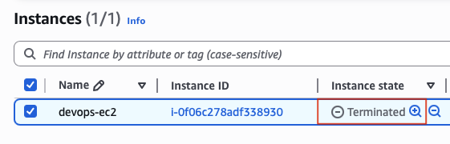

## Task: Terminate EC2 Instance
During the migration process, several resources were created under the AWS account. Later on, some of these resources became obsolete as alternative solutions were implemented. Similarly, there is an instance that needs to be deleted as it is no longer in use.

1. Delete the ec2 instance named devops-ec2 present in us-east-1 region.
2. Before submitting your task, make sure instance is in terminated state.

---

## Solution

### **Step 1: Log in to AWS Management Console**
Sign in with the credentials provided.

### **Step 2: Navigate to EC2 Service**
- In the top search bar, type **EC2**.  
- Select **EC2** from the services list.  
- This will take you to the EC2 Dashboard.

### **Step 3: Navigate to Instances**
- In the left navigation panel, click on **Instances**
- You will see a list of all EC2 instances in the us-east-1 region

### **Step 4: Locate the devops-ec2 Instance**
- Find the instance named `devops-ec2` in the instances list
- You can use the search/filter bar to quickly find it:
  - Type `devops-ec2` in the search box
  - Or filter by Name tag
- Click on the instance to select it (checkbox on the left)  

### **Step 5: Disable Termination Protection (If Enabled)**
**ONLY if termination protection is enabled:**
- With the `devops-ec2` instance selected
- Click **Actions** dropdown (top right)
- Navigate to **Instance settings**
- Select **Change termination protection**

### **Step 6: Initiate Instance Termination**
With the `devops-ec2` instance selected:
- Click the **Instance state** dropdown button (top right)
- Select **Terminate instance**  

### **Step 7: Verify Instance is Terminated**
Wait until the instance state changes to **Terminated**.  

**IMPORTANT:** The instance MUST show "terminated" state before submitting the task. Do NOT submit while it's still "shutting-down".
