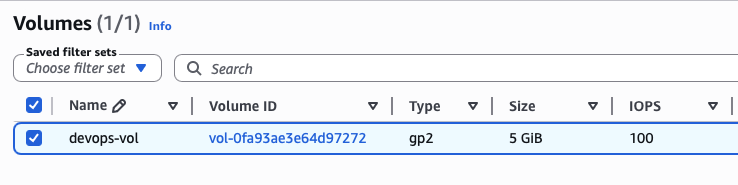
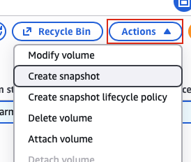
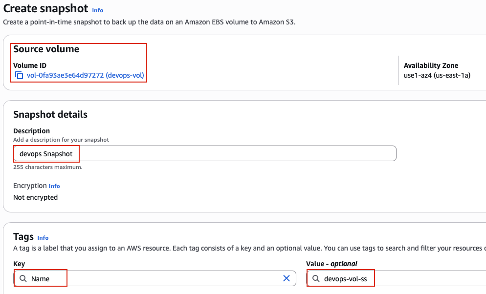
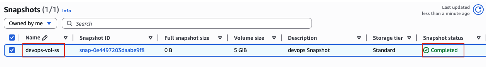

## Task: Create Volume Snapshot
The Nautilus DevOps team has some volumes in different regions in their AWS account. They are going to setup some automated backups so that all important data can be backed up on regular basis. For now they shared some requirements to take a snapshot of one of the volumes they have.

Create a snapshot of an existing volume named `devops-vol` in `us-east-1` region.

1. The name of the snapshot must be `devops-vol-ss`.
2. The description must be `devops Snapshot`.
3. Make sure the snapshot status is `completed` before submitting the task.

---

## Solution

### **Step 1: Log in to AWS Management Console**
Sign in with the credentials provided.

### **Step 2: Navigate to EC2 Service**
- In the top search bar, type **EC2**.  
- Select **EC2** from the services list.  
- This will take you to the EC2 Dashboard.

### **Step 3: Navigate to Volumes**
- In the left navigation panel, scroll down to the **Elastic Block Store** section
- Click on **Volumes**
- You will see a list of all EBS volumes in the **us-east-1** region

### **Step 4: Locate the devops-vol Volume**
- Find the volume named `devops-vol` in the volumes list
- You can use the search/filter bar to quickly find it:
  - Type `devops-vol` in the search box
  - Or filter by Name tag
- Click on the volume to select it (checkbox on the left)  

### **Step 5: Review Volume Status**
Before creating a snapshot, check the volume status:
- **State:** Can be either:
  - **In-use:** Volume is attached to an instance (snapshots can still be created)
  - **Available:** Volume is not attached (ideal for snapshots)
- **Attached resources:** If showing an instance ID, the volume is in use
- **Size:** Note the size as snapshot will be the same size

**IMPORTANT:** You can create snapshots of volumes whether they're attached or not. For in-use volumes, snapshots capture only data written to the volume at the moment the snapshot is initiated.

### **Step 6: Initiate Snapshot Creation**
With the `devops-vol` volume selected:
- Click the **Actions** dropdown button (top right)
- Select **Create snapshot**  

### **Step 7: Configure Snapshot Description**
The "Create snapshot" dialog will appear with configuration options:
- **Description:** Enter `devops Snapshot`

**Tags section:**
To name the snapshot `devops-vol-ss`, you must add a Name tag:
- Click **Add tag**
  - **Key:** Enter `Name` 
  - **Value:** Enter `devops-vol-ss` 
- Click **Create snapshot**  

### **Step 8: Navigate to Snapshots Section**
To verify and monitor the snapshot creation:
- In the left navigation panel, under **Elastic Block Store** section
- Click on **Snapshots**
- You will see a list of all snapshots in your account for the us-east-1 region

### **Step 9: Locate the New Snapshot**
Find your newly created snapshot:
- Look for snapshot named `devops-vol-ss`
- Use the search/filter bar if needed
- Wait for the snapshot to reach "completed" status.  

