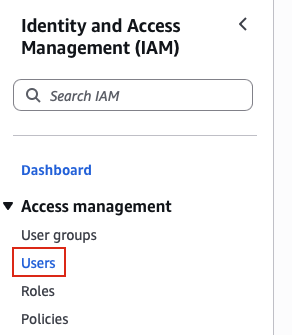
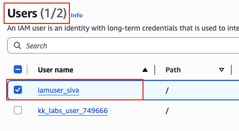

## Task: Creating an IAM User
When establishing infrastructure on the AWS cloud, Identity and Access Management (IAM) is among the first and most critical services to configure. IAM facilitates the creation and management of user accounts, groups, roles, policies, and other access controls. The Nautilus DevOps team is currently in the process of configuring these resources and has outlined the following requirements:

For this task, create an `IAM user` named `iamuser_siva`.

---

## Solution

### **Step 1: Log in to AWS Management Console**
Sign in with the credentials provided.

### **Step 2: Navigate to IAM Service**
- In the top search bar, type **IAM**.  
- Select **IAM** from the services list.  
- This will take you to the IAM Dashboard.  

### **Step 3: Navigate to Users Section**
- In the left navigation panel, under **Access management**
- Click on **Users**
- You will see a list of existing IAM users in your account (if any)  

### **Step 4: Initiate User Creation**
- Click the **Create user** button

### **Step 5: Specify User Details - User Name**
- **User name:** Enter `iamuser_siva`
- Leave other options as default
- Click **Create user**  

### **Step 6: Verify User Creation**
In the IAM Users list, verify the new user:
- Locate `iamuser_siva` in the users list
- Use the search bar if you have many users
- Verify the user appears in the list  

