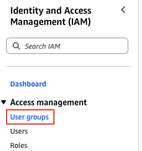
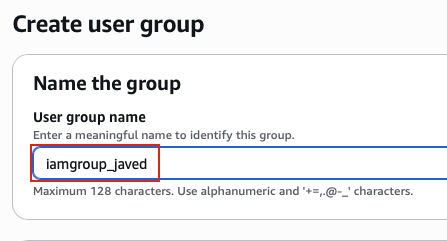
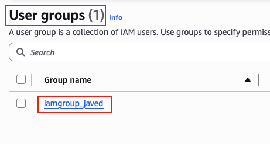

## Task: Create IAM Group
The Nautilus DevOps team has been creating a couple of services on AWS cloud. They have been breaking down the migration into smaller tasks, allowing for better control, risk mitigation, and optimization of resources throughout the migration process. Recently they came up with requirements mentioned below.

Create an `IAM group` named `iamgroup_javed`.

---

## Solution

### **Step 1: Log in to AWS Management Console**
Sign in with the credentials provided.

### **Step 2: Navigate to IAM Service**
- In the top search bar, type **IAM**.  
- Select **IAM** from the services list.  
- This will take you to the IAM Dashboard.  

### **Step 3: Navigate to User Groups Section**
- In the left navigation panel, under **Access management**
- Click on **User groups**
- You will see a list of existing IAM user groups in your account (if any)  

### **Step 4: Initiate Group Creation**
- Click the **Create group** button

### **Step 5: Specify Group Details**
- **User group name:** Enter `iamgroup_javed`
- Leave other options as default
- Click **Create user group**  

### **Step 6: Verify User Group Creation**
In the IAM User groups list, verify the new group:
- Locate `iamgroup_javed` in the groups list
- Use the search bar if you have many groups
- Verify the group appears in the list  

