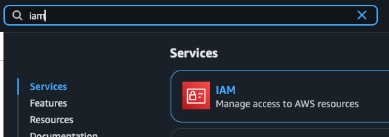
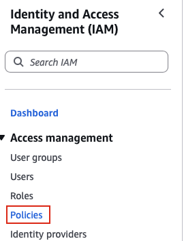
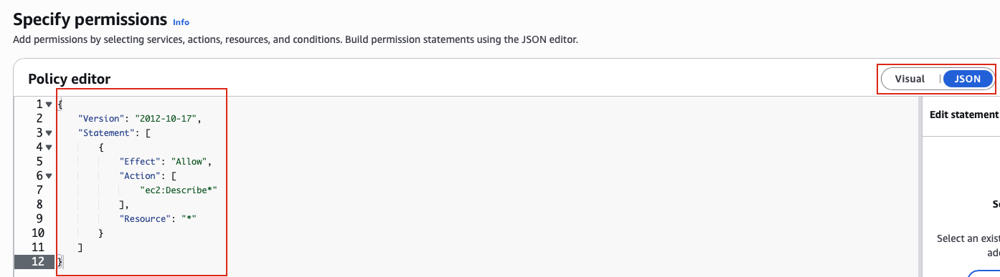
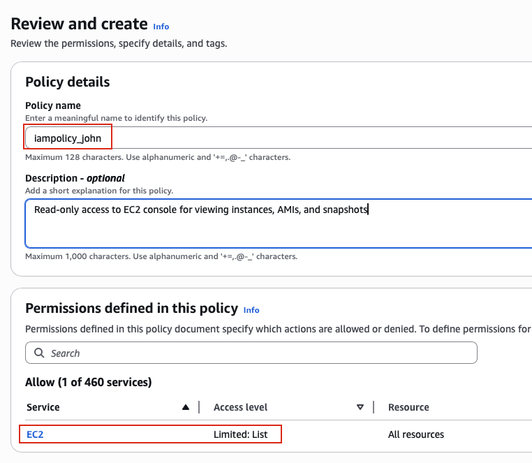

## Task: Create Read-Only IAM Policy for EC2 Console Access
When establishing infrastructure on the AWS cloud, Identity and Access Management (IAM) is among the first and most critical services to configure. IAM facilitates the creation and management of user accounts, groups, roles, policies, and other access controls. The Nautilus DevOps team is currently in the process of configuring these resources and has outlined the following requirements.

Create an IAM policy named `iampolicy_john` in `us-east-1` region, it must allow `read-only` access to the `EC2 console`, i.e this policy must allow users to view all instances, AMIs, and snapshots in the Amazon EC2 console.

---

## Solution

### **Step 1: Log in to AWS Management Console**
Sign in with the credentials provided.

### **Step 2: Navigate to IAM Service**
- In the top search bar, type **IAM**.  
- Select **IAM** from the services list.  
- This will take you to the IAM Dashboard.  


### **Step 3: Navigate to Policies Section**
- In the left navigation panel, under **Access management**
- Click on **Policies**
- You will see a list of existing policies (AWS managed and customer managed)  


### **Step 4: Initiate Policy Creation**
- Click the **Create policy** button in the top right corner

### **Step 5: Choose Policy Editor**
You'll see two options for creating the policy:

**Visual editor:** (Default)
- User-friendly interface for building policies
- Select services, actions, and resources through dropdowns
- Good for beginners

**JSON editor:**
- Write policy in JSON format
- More control and flexibility
- Better for complex policies or copy-pasting existing policies

**For this task:** We'll use the **JSON editor**.

### **Step 6: Switch to JSON Editor**
Paste the following **JSON Policy for EC2 Read-Only Access:**
```json
{
  "Version": "2012-10-17",
  "Statement": [
    {
      "Effect": "Allow",
      "Action": [
        "ec2:Describe*"
      ],
      "Resource": "*"
    }
  ]
}
```

This policy allows all EC2 "Describe" actions (read-only) on all resources.  


### **Step 7: Review Policy**
After configuring the policy (visual or JSON):
- Click **Next** button at the bottom
- You'll be taken to the policy review page

### **Step 8: Specify Policy Name**
- **Policy name:** Enter `iampolicy_john`
- **Description:** Enter `Read-only access to EC2 console for viewing instances, AMIs, and snapshots`
- Click **Create Policy**  

