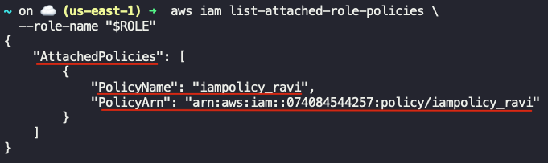

## Task: Create IAM Role for EC2 with Policy Attachment
When establishing infrastructure on the AWS cloud, Identity and Access Management (IAM) is among the first and most critical services to configure. IAM facilitates the creation and management of user accounts, groups, roles, policies, and other access controls. The Nautilus DevOps team is currently in the process of configuring these resources and has outlined the following requirements:

Create an IAM role as below:
1. IAM role name must be `iamrole_ravi`.
2. Entity type must be `AWS Service` and use case must be `EC2`.
3. Attach a policy named `iampolicy_ravi`.

---

## Solution

We'll be performing the task using AWS CLI

### Step 1: Set variables
```bash
ROLE="iamrole_ravi"
POLICY="iampolicy_ravi"
```

### Step 2: Create a Trust Policy Document for EC2
Create a JSON file named `trust-policy.json` with the following content
```bash
cat <<EOF >trust-policy.json
{
  "Version": "2012-10-17",
  "Statement": [
    {
      "Effect": "Allow",
      "Principal": {
        "Service": "ec2.amazonaws.com"
      },
      "Action": "sts:AssumeRole"
    }
  ]
}
EOF
```

### Step 3: Create the IAM Role
```bash
aws iam create-role \
  --role-name "$ROLE" \
  --assume-role-policy-document file://trust-policy.json
```

### Step 4: Get the ARN of the Policy
```bash
POLICY_ARN=$(aws iam list-policies --scope Local \
  --query "Policies[?PolicyName==\`$POLICY\`].Arn" \
  --output text)
```

### Step 5: Attach the Policy to the Role
```bash
aws iam attach-role-policy \
  --role-name "$ROLE" \
  --policy-arn "$POLICY_ARN"
```

### Step 6: Validate the Policy Attachment
```bash
aws iam list-attached-role-policies \
  --role-name "$ROLE"
```

You should see something like:  
