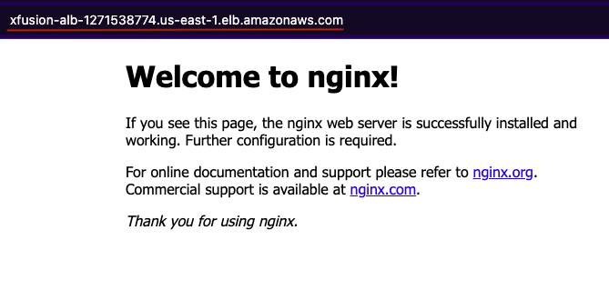

## Task: Setting Up an Application Load Balancer for an EC2 Instance
The Nautilus DevOps team is currently working on setting up a simple application on the AWS cloud. They aim to establish an Application Load Balancer (ALB) in front of an EC2 instance where an Nginx server is currently running. While the Nginx server currently serves a sample page, the team plans to deploy the actual application later.

1. Set up an Application Load Balancer named `xfusion-alb`.
2. Create a target group named `xfusion-tg`.
3. Create a security group named `xfusion-sg` to open port `80` for the public.
4. Attach this security group to the ALB.
5. The ALB should route traffic on port `80` to port `80` of the `xfusion-ec2` instance.
6. Make appropriate changes in the default security group attached to the EC2 instance if necessary.

---

## Solution

### Step 1: Set variables
```bash
EC2_NAME="xfusion-ec2"
ALB_NAME="xfusion-alb"
TG_NAME="xfusion-tg"
SG_NAME="xfusion-sg"
```

### Step 2: Fetch EC2 and VPC IDs
```bash
EC2_INSTANCE_ID=$(aws ec2 describe-instances \
  --filters "Name=tag:Name,Values=$EC2_NAME" \
  --query "Reservations[*].Instances[*].InstanceId" \
  --output text)

VPC_ID=$(aws ec2 describe-instances --instance-ids "$EC2_INSTANCE_ID" \
    --query "Reservations[0].Instances[0].VpcId" --output text)

#Get the subnets for the ALB (needs at least two)
SUBNETS=$(aws ec2 describe-subnets --filters "Name=vpc-id,Values=$VPC_ID" \
    --query "Subnets[*].SubnetId" --output text)
```

### Step 3: Create Security Group for ALB (port 80 public)
```bash
ALB_SG_ID=$(aws ec2 create-security-group \
  --group-name "$SG_NAME" \
  --description "Security group for ALB allowing HTTP" \
  --vpc-id "$VPC_ID" \
  --query "GroupId" --output text)

# Allow inbound HTTP
aws ec2 authorize-security-group-ingress \
  --group-id "$ALB_SG_ID" \
  --protocol tcp --port 80 --cidr 0.0.0.0/0
```

### Step 4: Create the Target Group
```bash
TG_ARN=$(aws elbv2 create-target-group \
  --name "$TG_NAME" \
  --protocol HTTP \
  --port 80 \
  --target-type instance \
  --vpc-id "$VPC_ID" \
  --query "TargetGroups[0].TargetGroupArn" \
  --output text)
```

### Step 5: Register the EC2 Instance with the Target Group
```bash
aws elbv2 register-targets \
  --target-group-arn "$TG_ARN" \
  --targets "Id=$EC2_INSTANCE_ID"
```

### Step 6: Create the Application Load Balancer
```bash
ALB_ARN=$(aws elbv2 create-load-balancer \
  --name "$ALB_NAME" \
  --type application \
  --security-groups "$ALB_SG_ID" \
  --subnets $SUBNETS \
  --query "LoadBalancers[0].LoadBalancerArn" \
  --output text)
```

### Step 7: Create Listener on Port 80 → Forward to Target Group
```bash
aws elbv2 create-listener \
  --load-balancer-arn "$ALB_ARN" \
  --protocol HTTP \
  --port 80 \
  --default-actions Type=forward,TargetGroupArn="$TG_ARN"
```

### Step 8: Update EC2 Security Group (Allow ALB → EC2 on port 80)
Get EC2 security group
```bash
EC2_SG_ID=$(aws ec2 describe-instances \
    --instance-ids "$EC2_INSTANCE_ID" \
    --query "Reservations[0].Instances[0].SecurityGroups[0].GroupId" \
    --output text)
```
Allow traffic from ALB SG → EC2 on port 80
```bash
aws ec2 authorize-security-group-ingress \
  --group-id "$EC2_SG_ID" \
  --protocol tcp --port 80 \
  --source-group "$ALB_SG_ID"
```

### Step 9: Verification
Get ALB DNSName
```bash
aws elbv2 describe-load-balancers \
  --load-balancer-arns "$ALB_ARN" \
  --query "LoadBalancers[0].DNSName" \
  --output text
```


Open the DNS in a browser, you should see the **Nginx welcome page** from the EC2 instance.

