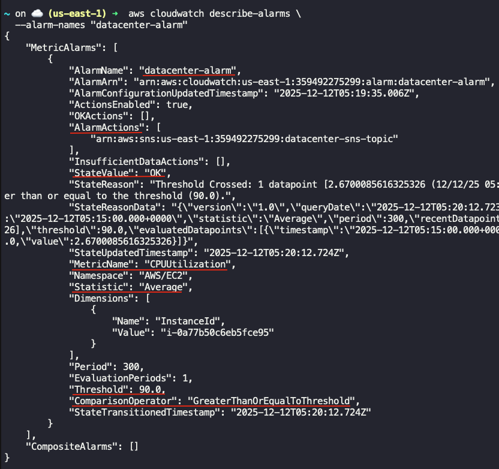

## Task: : Setting Up an EC2 Instance and CloudWatch Alarm
The Nautilus DevOps team has been tasked with setting up an EC2 instance for their application. To ensure the application performs optimally, they also need to create a CloudWatch alarm to monitor the instance's CPU utilization. The alarm should trigger if the CPU utilization exceeds 90% for one consecutive 5-minute period. To send notifications, use the SNS topic named `datacenter-sns-topic` which is already created.

1. Launch EC2 Instance: Create an EC2 instance named `datacenter-ec2` using any appropriate `Ubuntu` AMI.
2. Create CloudWatch Alarm: Create a CloudWatch alarm named `datacenter-alarm` with the following specifications:
    - Statistic: `Average`
    - Metric: `CPU Utilization`
    - Threshold: `>= 90% for 1 consecutive 5-minute period`.
    - Alarm Actions: Send a notification to `datacenter-sns-topic`.

---

## Solution

### Step 1: Set variables
```bash
EC2_NAME="datacenter-ec2"
INSTANCE_TYPE="t2.micro"
ALARM_NAME="datacenter-alarm"
SNS_TOPIC_NAME="datacenter-sns-topic"
REGION="us-east-1"
```

### Step 2: Fetch AMI ID
Get AMI ID of `Ubuntu 22.04` image in `us-east-1` region
```bash
AMI_ID=$(aws ec2 describe-images \
  --region $REGION \
  --owners 099720109477 \
  --filters "Name=name,Values=ubuntu/images/hvm-ssd/ubuntu-jammy-22.04-amd64-server-*" "Name=state,Values=available" \
  --query "sort_by(Images, &CreationDate)[-1].ImageId" \
  --output text
)
```

### Step 3: Create EC2 Instance
```bash
INSTANCE_ID=$(aws ec2 run-instances \
  --image-id "$AMI_ID" \
  --instance-type "$INSTANCE_TYPE" \
  --tag-specifications "ResourceType=instance,Tags=[{Key=Name,Value=$EC2_NAME}]" \
  --query "Instances[0].InstanceId" \
  --output text)

echo "EC2 Instance ID: $INSTANCE_ID"
```

### Step 4: Get SNS Topic ARN
```bash
SNS_ARN=$(aws sns list-topics \
  --query "Topics[?contains(TopicArn, \`$SNS_TOPIC_NAME\`)].TopicArn" \
  --output text)
```

### Step 5: Wait for the instance to be running
```bash
aws ec2 wait instance-running --instance-ids "$INSTANCE_ID"
```

### Step 6: Create CloudWatch Alarm
```bash
aws cloudwatch put-metric-alarm \
  --alarm-name $ALARM_NAME \
  --metric-name CPUUtilization \
  --namespace AWS/EC2 \
  --statistic Average \
  --period 300 \
  --evaluation-periods 1 \
  --threshold 90 \
  --comparison-operator GreaterThanOrEqualToThreshold \
  --dimensions Name=InstanceId,Value="$INSTANCE_ID" \
  --alarm-actions "$SNS_ARN"
```

### Step 7: Verfiy Cloudwatch Alarm details
```bash
aws cloudwatch describe-alarms \
  --alarm-names "datacenter-alarm"
```
