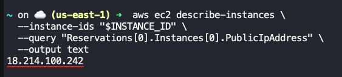
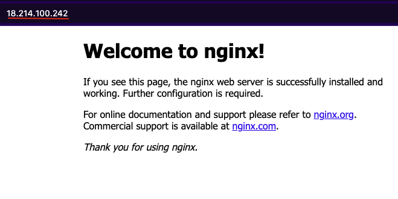

## Task: Configuring an EC2 Instance as a Web Server with Nginx
The Nautilus DevOps Team is working on setting up a new web server for a critical application. The team lead has requested you to create an EC2 instance that will serve as a web server using Nginx. This instance will be part of the initial infrastructure setup for the Nautilus project. Ensuring that the server is correctly configured and accessible from the internet is crucial for the upcoming deployment phase.

As a member of the Nautilus DevOps Team, your task is to create an EC2 instance with the following specifications:

1. **Instance Name**: The EC2 instance must be named `devops-ec2`.
2. **AMI**: Use any available `Ubuntu AMI` to create this instance.
3. **User Data Script**: Configure the instance to run a user data script during its launch. This script should:
    - Install the `Nginx` package.
    - Start the `Nginx` service.
4. **Security Group**: Ensure that the instance allows `HTTP traffic` on port `80` from the internet.

---

## Solution

### Step 1: Set variables
```bash
EC2_NAME="devops-ec2"
INSTANCE_TYPE="t2.micro"
SECURITY_GROUP="devops-ec2-sg"
REGION="us-east-1"
```

### Step 2: Fetch AMI ID
Get AMI ID of `Ubuntu 22.04` image in `us-east-1` region
```bash
AMI_ID=$(aws ec2 describe-images \
  --region $REGION \
  --owners 099720109477 \
  --filters "Name=name,Values=ubuntu/images/hvm-ssd/ubuntu-jammy-22.04-amd64-server-*" "Name=state,Values=available" \
  --query "sort_by(Images, &CreationDate)[-1].ImageId" \
  --output text
)
```

### Step 3: Create a Security Group allowing port 80
```bash
VPC_ID=$(aws ec2 describe-vpcs --query "Vpcs[0].VpcId" --output text)

SG_ID=$(aws ec2 create-security-group \
  --group-name $SECURITY_GROUP \
  --description "Security Group for Nginx Web Server" \
  --vpc-id "$VPC_ID" \
  --query "GroupId" --output text)

echo "Created SG: $SG_ID"
```
Allow HTTP (port 80) from anywhere
```bash
aws ec2 authorize-security-group-ingress \
  --group-id "$SG_ID" \
  --protocol tcp \
  --port 80 \
  --cidr 0.0.0.0/0
```

### Step 4: Create User Data Script (for Nginx)
```bash
USER_DATA='#!/bin/bash
apt update -y
apt install nginx -y
systemctl enable nginx
systemctl start nginx
'
```

### Step 5: Launch the EC2 instance
```bash
INSTANCE_ID=$(aws ec2 run-instances \
  --image-id "$AMI_ID" \
  --instance-type "$INSTANCE_TYPE" \
  --security-group-ids "$SG_ID" \
  --user-data "$USER_DATA" \
  --tag-specifications "ResourceType=instance,Tags=[{Key=Name,Value=$EC2_NAME}]" \
  --query "Instances[0].InstanceId" \
  --output text)

echo "EC2 Instance Created: $INSTANCE_ID"
```

### Step 6: Wait for the instance to be running
```bash
aws ec2 wait instance-running --instance-ids "$INSTANCE_ID"
```

### Step 7: Verification - Check if the Nginx webpage is accessible
Retrieve Public IP of the EC2 instance
```bash
aws ec2 describe-instances \
  --instance-ids "$INSTANCE_ID" \
  --query "Reservations[0].Instances[0].PublicIpAddress" \
  --output text
```


Enter the IP address in a browser, you should see the **Nginx welcome page**.  

