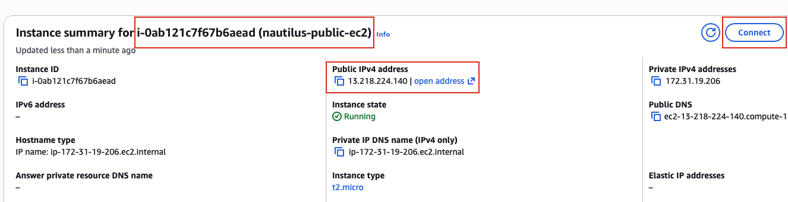

## Task: Establishing Secure Communication Between Public and Private VPCs via VPC Peering
The Nautilus DevOps team has been tasked with demonstrating the use of VPC Peering to enable communication between two VPCs. One VPC will be a private VPC that contains a private EC2 instance, while the other will be the default public VPC containing a publicly accessible EC2 instance.

1. There is already an existing **EC2 instance** in the public vpc/subnet:
    - Name: `nautilus-public-ec2`
2. There is already an existing Private VPC:
    - Name: `nautilus-private-vpc`
    - CIDR: `10.1.0.0/16`
3. There is already an existing **Subnet** in `nautilus-private-vpc`:
    - Name: `nautilus-private-subnet`
    - CIDR: `10.1.1.0/24`
4. There is already an existing **EC2 instance** in the private subnet:
    - Name: `nautilus-private-ec2`
5. **Create a Peering Connection** between the Default VPC and the Private VPC:
    - VPC Peering Connection Name: `nautilus-vpc-peering`
6. **Configure Route Tables** to enable communication between the two VPCs.
    - Ensure the private EC2 instance is accessible from the public EC2 instance.
7. **Test the Connection**:
    - Add `/root/.ssh/id_rsa.pub` public key to the public EC2 instance's `ec2-user`'s `authorized_keys` to make sure we are able to ssh into this instance from AWS client host. You may also need to update the security group of the private EC2 instance to allow ICMP traffic from the public/default VPC CIDR. This will enable you to ping the private instance from the public instance.
    - SSH into the public EC2 instance and ensure that you can ping the private EC2 instance.

---

## Solution

### Step 1: Set Variables
```bash
PUB_EC2_NAME="nautilus-public-ec2"
PRIV_VPC_NAME="nautilus-private-vpc"
PRIV_CIDR="10.1.0.0/16"
PRIV_EC2_NAME="nautilus-private-ec2"
VPC_PEERING="nautilus-vpc-peering"
```

### Step 2: Identify Required Resource IDs
Get Default VPC ID
```bash
PUB_VPC_ID=$(aws ec2 describe-vpcs \
  --filters Name=isDefault,Values=true \
  --query "Vpcs[0].VpcId" \
  --output text)

# Get CIDR of the public VPC
PUB_CIDR=$(aws ec2 describe-vpcs --vpc-ids "$PUB_VPC_ID" --query "Vpcs[0].CidrBlock" --output text)
```
Get Private VPC ID
```bash
PRIV_VPC_ID=$(aws ec2 describe-vpcs \
  --filters Name=tag:Name,Values=$PRIV_VPC_NAME \
  --query "Vpcs[0].VpcId" \
  --output text)
```
Get EC2 Instance IDs
```bash
PUB_EC2_ID=$(aws ec2 describe-instances \
  --filters Name=tag:Name,Values=$PUB_EC2_NAME \
  --query "Reservations[0].Instances[0].InstanceId" \
  --output text)

PRIV_EC2_ID=$(aws ec2 describe-instances \
  --filters Name=tag:Name,Values=$PRIV_EC2_NAME \
  --query "Reservations[0].Instances[0].InstanceId" \
  --output text)
```

### Step 3: Create VPC Peering Connection
```bash
PEERING_ID=$(aws ec2 create-vpc-peering-connection \
  --vpc-id "$PUB_VPC_ID" \
  --peer-vpc-id "$PRIV_VPC_ID" \
  --tag-specifications 'ResourceType=vpc-peering-connection,Tags=[{Key=Name,Value='"$VPC_PEERING"'}]' \
  --query "VpcPeeringConnection.VpcPeeringConnectionId" \
  --output text)
```
Accept the peering connection
```bash
aws ec2 accept-vpc-peering-connection \
  --vpc-peering-connection-id "$PEERING_ID"
```

### Step 4: Configure Route Tables
Add Route in Public VPC Route Table
```bash
PUB_RT_ID=$(aws ec2 describe-route-tables \
  --filters Name=vpc-id,Values="$PUB_VPC_ID" Name=association.main,Values=true \
  --query "RouteTables[0].RouteTableId" \
  --output text)

aws ec2 create-route \
  --route-table-id "$PUB_RT_ID" \
  --destination-cidr-block "$PRIV_CIDR" \
  --vpc-peering-connection-id "$PEERING_ID"
```
Add Route in Private VPC Route Table
```bash
PRIV_RT_ID=$(aws ec2 describe-route-tables \
  --filters Name=vpc-id,Values="$PRIV_VPC_ID" \
  --query "RouteTables[0].RouteTableId" \
  --output text)

aws ec2 create-route \
  --route-table-id "$PRIV_RT_ID" \
  --destination-cidr-block "$PUB_CIDR" \
  --vpc-peering-connection-id "$PEERING_ID"
```

### Step 5: Security Group Updates
Allow ICMP on Private EC2
```bash
PRIV_SG_ID=$(aws ec2 describe-instances \
  --instance-ids "$PRIV_EC2_ID" \
  --query "Reservations[0].Instances[0].SecurityGroups[0].GroupId" \
  --output text)

aws ec2 authorize-security-group-ingress \
  --group-id "$PRIV_SG_ID" \
  --protocol icmp \
  --port -1 \
  --cidr "$PUB_CIDR"
```
Allow SSH on Public EC2
```bash
PUB_SG_ID=$(aws ec2 describe-instances \
  --instance-ids "$PUB_EC2_ID" \
  --query "Reservations[0].Instances[0].SecurityGroups[0].GroupId" \
  --output text)

aws ec2 authorize-security-group-ingress \
  --group-id "$PUB_SG_ID" \
  --protocol tcp \
  --port 22 \
  --cidr 0.0.0.0/0
```

### Step 6: Copy the ssh public key from AWS client host
We need to add the public key to the `ec2-user`'s `authorized_keys` file on the public EC2 instance
```bash
cat /root/.ssh/id_rsa.pub
```


**Note:** We'll be doing the following step from the AWS Management Console
### Step 7: Enable passwordless SSH Access to Public EC2 from AWS client host
- Login to AWS Management Console using the credentials provided with the lab.
- Navigate to the Public EC2 instance page.
- Click **Connect**.  

- Connect using **EC2 Instance Connect**
- Once connected to the public instance
  - Edit the `/home/ec2-user/.ssh/authorized_keys`
  - Add the public key copied in Step 6 to this file
- Test if you are able to ping the private instance from public instance
  - `ping <PRIV_EC2_PRIV_IP>`


### Step 8: Verfication (Optional)
From AWS client host
```bash
# SSH to the public instance
ssh ec2-user@<PUB_EC2_PUBLIC_IP>
# Ping the private instance from public instance
ping -c 5 <PRIV_EC2_PRIV_IP>
```