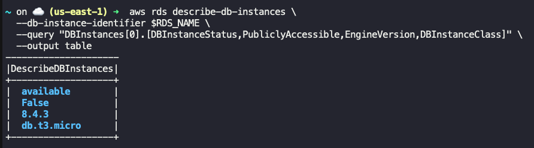

## Task: Snapshot and Restoration of an RDS Instance
The Nautilus Development Team is preparing for a major update to their database infrastructure. To ensure a smooth transition and to safeguard data, the team has requested the DevOps team to take a snapshot of the current RDS instance and restore it to a new instance. This process is crucial for testing and validation purposes before the update is rolled out to the production environment. The snapshot will serve as a backup, and the new instance will be used to verify that the backup process works correctly and that the application can function seamlessly with the restored data.

As a member of the Nautilus DevOps Team, your task is to perform the following:

1. **Take a Snapshot**: Take a snapshot of the `devops-rds` RDS instance and name it `devops-snapshot` (please wait `devops-rds` instance to be in `available` state).
2. **Restore the Snapshot**: Restore the snapshot to a new RDS instance named `devops-snapshot-restore`.
3. **Configure the New RDS Instance**: Ensure that the new RDS instance has a class of `db.t3.micro`.
4. **Verify the New RDS Instance**: The new RDS instance must be in the `Available` state upon completion of the restoration process.

---

## Solution

### Step 1: Set Variables
```bash
SOURCE_RDS_NAME="devops-rds"
SNAPSHOT_NAME="devops-snapshot"
RDS_NAME="devops-snapshot-restore"
INSTANCE_TYPE="db.t3.micro"
```

### Step 2: Ensure the source RDS instance is in available state.
Wait until it becomes `available`
```bash
aws rds wait db-instance-available \
  --db-instance-identifier $SOURCE_RDS_NAME
```
Confirm state
```bash
aws rds describe-db-instances \
  --db-instance-identifier $SOURCE_RDS_NAME \
  --query "DBInstances[0].[DBInstanceStatus,PubliclyAccessible,EngineVersion,DBInstanceClass]" \
  --output table
```

### Step 3: Take Snapshot
```bash
aws rds create-db-snapshot \
  --db-instance-identifier $SOURCE_RDS_NAME \
  --db-snapshot-identifier $SNAPSHOT_NAME
```
Wait for the snapshot to complete
```bash
aws rds wait db-snapshot-available \
  --db-snapshot-identifier $SNAPSHOT_NAME
```

### Step 4: Restore Snapshot to New RDS Instance
```bash
aws rds restore-db-instance-from-db-snapshot \
  --db-instance-identifier $RDS_NAME \
  --db-snapshot-identifier $SNAPSHOT_NAME \
  --db-instance-class $INSTANCE_TYPE \
  --no-publicly-accessible
```
**Note:** Subnet group, VPC, and storage settings are inherited automatically from the snapshot

### Step 5: Validate RDS restoration
Wait until restored instance becomes `available`
```bash
aws rds wait db-instance-available \
  --db-instance-identifier $RDS_NAME
```
View status
```bash
aws rds describe-db-instances \
  --db-instance-identifier $RDS_NAME \
  --query "DBInstances[0].[DBInstanceStatus,PubliclyAccessible,EngineVersion,DBInstanceClass]" \
  --output table
```
