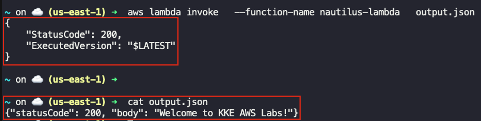

## Task: Create a Lambda Function
The Nautilus DevOps team is embracing serverless architecture by integrating AWS Lambda into their operational tasks. They have decided to deploy a simple Lambda function that will return a custom greeting to demonstrate serverless capabilities effectively. This function is crucial for showcasing rapid deployment and easy scalability features of AWS Lambda to the team.

1. **Create Lambda Function**: Create a Lambda function named `nautilus-lambda`.
2. **Runtime**: Use the Runtime `Python`.
3. **Deploy**: The function should print the body `Welcome to KKE AWS Labs!`.
4. **Status Code**: Ensure the status code is `200`.
5. **IAM Role**: Create and use the IAM role named `lambda_execution_role`.

---

## Solution

### Step 1: Set Variables
```bash
LAMBDA_NAME="nautilus-lambda"
RUNTIME="python3.9"
IAM_ROLE="lambda_execution_role"
```

### Step 2: Create IAM Role for Lambda
Create IAM Role for Lambda
```bash
cat > trust-policy.json <<EOF
{
  "Version": "2012-10-17",
  "Statement": [
    {
      "Effect": "Allow",
      "Principal": {
        "Service": "lambda.amazonaws.com"
      },
      "Action": "sts:AssumeRole"
    }
  ]
}
EOF
```
Create the IAM role
```bash
aws iam create-role \
  --role-name $IAM_ROLE \
  --assume-role-policy-document file://trust-policy.json
```
Attach basic lambda execution policy
```bash
aws iam attach-role-policy \
  --role-name $IAM_ROLE \
  --policy-arn arn:aws:iam::aws:policy/service-role/AWSLambdaBasicExecutionRole
```
Get role ARN
```bash
ROLE_ARN=$(aws iam get-role \
  --role-name $IAM_ROLE \
  --query "Role.Arn" \
  --output text)
```

### Step 3: Create Lambda Function Code
```bash
cat > lambda_function.py <<EOF
def lambda_handler(event, context):
    return {
        "statusCode": 200,
        "body": "Welcome to KKE AWS Labs!"
    }
EOF
```
Zip the function
```bash
zip function.zip lambda_function.py
```

### Step 4: Create the Lambda Function
```bash
aws lambda create-function \
  --function-name $LAMBDA_NAME \
  --runtime $RUNTIME \
  --role "$ROLE_ARN" \
  --handler lambda_function.lambda_handler \
  --zip-file fileb://function.zip
```

### Step 5: Verify Lambda Function
Invoke the function
```bash
aws lambda invoke \
  --function-name $LAMBDA_NAME \
  output.json
```
Check output
```bash
cat output.json
```
