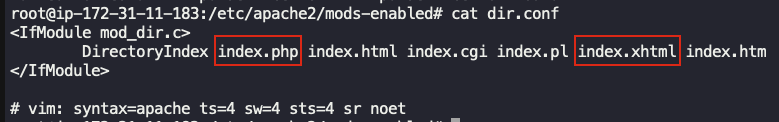
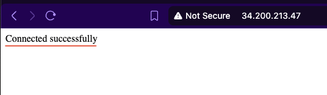

## Task: Deploying and Managing Applications on AWS
The Nautilus DevOps team needs a new private RDS instance for their application. They need to set up a MySQL database and ensure that their existing EC2 instance can connect to it. This will help in managing their database needs efficiently and securely.

1. **Task Details**:
    - Create a private RDS instance named `nautilus-rds` using a `sandbox` template.
    - The engine type must be `MySQL v8.4.5`, and it must be a `db.t3.micro` type instance.
    - The master username must be `nautilus_admin` with an appropriate password.
    - The RDS storage type must be `gp2`, and the storage size must be `5GiB`.
    - Create a database named `nautilus_db`.
    - Keep the rest of the configurations as `default`. Ensure the instance is in `available` state.
    - Adjust the security groups so that the `nautilus-ec2` instance can connect to the RDS on `port 3306` and also open port `80` for the instance.
2. An EC2 instance named `nautilus-ec2` exists. Connect to this instance from the AWS console. Create an SSH key (`/root/.ssh/id_rsa`) on the `aws-client` host if it doesn't already exist. Add the public key to the authorized keys of the `root` user on the EC2 instance for password-less SSH access.
3. There is a file named `index.php` under the `/root` directory on the `aws-client` host. Copy this file to the `nautilus-ec2` instance under the `/var/www/html/` directory. Make the appropriate changes in the file to connect to the RDS.
4. You should see a `Connected successfully` message in the browser once you access the instance using the public IP.

---

## Solution

### Step 1: Set Variables
```bash
RDS_NAME="nautilus-rds"
ENGINE="mysql"
ENGINE_VERSION="8.4.5"
DB_INSTANCE_TYPE="db.t3.micro"
DB_STORAGE=5
DB_STORAGE_TYPE="gp2"
DB_USER="nautilus_admin"
DB_NAME="nautilus_db"
DB_SUBNET_GROUP="db-subnet-group"
RDS_SECURITY_GROUP="rds-sg"
EC2_NAME="nautilus-ec2"
```

### Step 2: Get Default VPC & Subnets
```bash
VPC_ID=$(aws ec2 describe-vpcs \
  --filters Name=isDefault,Values=true \
  --query "Vpcs[0].VpcId" \
  --output text)
```
Get subnet IDs
```bash
SUBNET_IDS=$(aws ec2 describe-subnets \
  --filters Name=vpc-id,Values="$VPC_ID" \
  --query "Subnets[*].SubnetId" \
  --output text)
```
Create DB Subnet Group
```bash
aws rds create-db-subnet-group \
  --db-subnet-group-name $DB_SUBNET_GROUP \
  --db-subnet-group-description "Nautilus RDS subnet group" \
  --subnet-ids $SUBNET_IDS
```

### Step 3: Create Security Group for RDS
```bash
RDS_SG_ID=$(aws ec2 create-security-group \
  --group-name $RDS_SECURITY_GROUP \
  --description "RDS access from ec2 instance" \
  --vpc-id "$VPC_ID" \
  --query "GroupId" \
  --output text)
```

### Step 4: Create RDS Instance
```bash
aws rds create-db-instance \
  --db-instance-identifier $RDS_NAME \
  --engine $ENGINE \
  --engine-version $ENGINE_VERSION \
  --db-instance-class $DB_INSTANCE_TYPE \
  --allocated-storage $DB_STORAGE \
  --storage-type $DB_STORAGE_TYPE \
  --master-username $DB_USER \
  --master-user-password AdminPa55 \
  --db-name $DB_NAME \
  --db-subnet-group-name $DB_SUBNET_GROUP \
  --vpc-security-group-ids "$RDS_SG_ID" \
  --no-publicly-accessible
```
Wait until available
```bash
aws rds wait db-instance-available \
  --db-instance-identifier $RDS_NAME
```

### Step 5: Configure Security Groups
**Allow MySQL (3306) from EC2**
Get EC2 security group
```bash
EC2_ID=$(aws ec2 describe-instances \
  --filters Name=tag:Name,Values=$EC2_NAME \
  --query "Reservations[0].Instances[0].InstanceId" \
  --output text)

EC2_SG_ID=$(aws ec2 describe-instances \
  --instance-ids "$EC2_ID" \
  --query "Reservations[0].Instances[0].SecurityGroups[0].GroupId" \
  --output text)
```
Allow EC2 → RDS
```bash
aws ec2 authorize-security-group-ingress \
  --group-id "$RDS_SG_ID" \
  --protocol tcp \
  --port 3306 \
  --source-group "$EC2_SG_ID"
```
**Open HTTP (80) on EC2**
```bash
aws ec2 authorize-security-group-ingress \
  --group-id "$EC2_SG_ID" \
  --protocol tcp \
  --port 80 \
  --cidr 0.0.0.0/0
```
Add an inbound rule to allow SSH (port 22)
```bash
aws ec2 authorize-security-group-ingress \
    --group-id "$EC2_SG_ID" \
    --protocol tcp \
    --port 22 \
    --cidr "0.0.0.0/0"
```

### Step 6: SSH Key Setup (we'll be doing this part from AWS management console)
Create SSH Key on **AWS client host**
```bash
ssh-keygen
```
Copy the public key
```bash
cat /root/.ssh/id_rsa.pub
```

From the **AWS management console**
- Connect to the EC2 instance using **EC2 Instance Connect**  
  **Note:** Make sure `SSH` access is allowed by the EC2 security group.
- On the EC2 instance switch to `root` user:
  ```bash
  sudo su -
  ```
- Add the public key copied earlier from aws-client to `/root/.ssh/authorized_keys` file on the EC2 instance
- After adding the public key you should be able to `SSH` to the EC2 instance as `root` user.

### Step 7: Copy PHP File & Configure DB Connection
**From AWS client host:**
Get RDS endpoint
```bash
RDS_ENDPOINT=$(aws rds describe-db-instances \
  --db-instance-identifier $RDS_NAME \
  --query "DBInstances[0].Endpoint.Address" \
  --output text)

echo "RDS endpoint: $RDS_ENDPOINT"
```
Replace the placeholders with the actual RDS values
```
<dbname> → nautilus_db
<dbuser> → nautilus_admin
<dbpass> → AdminPa55
<dbhost> → <RDS_ENDPOINT>
```
Copy `index.php` file to EC2 instance
```bash
scp /root/index.php root@<VM_PUBLIC_IP>:/var/www/html/index.php
```

### Step 8: Update configuration files on EC2 instance
SSH to the instance from the **AWS client host**
```bash
ssh root@<VM_PUBLIC_IP>
```
**Note:** For this task `apache2` is running on a `ubuntu` instance, if the setup is different update the configuration files accordingly.  

Update `/etc/apache2/mods-enabled/dir.conf` to serve `index.php`
- `index.php` should be before `index.html`  
  
*OR*  
Delete the `index.html` file from `/var/www/html/` location on the EC2 instance

### Step 9: Verification
Access the EC2 instance with its public IP from a web browser of your choice.  
You should `Connected successfully` message.  

