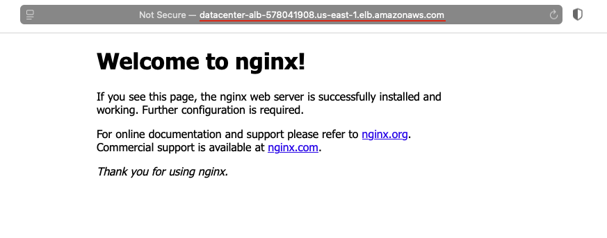

## Task: Load Balancing EC2 Instances with Application Load Balancer
The Nautilus Development Team needs to set up a new EC2 instance and configure it to run a web server. This EC2 instance should be part of an Application Load Balancer (ALB) setup to ensure high availability and better traffic management. The task involves creating an EC2 instance, setting up an ALB, configuring a target group, and ensuring the web server is accessible via the ALB DNS.

**Create a security group**: Create a security group named `datacenter-sg` to open port `80` for the `default` security group (which will be attached to the ALB). Attach `datacenter-sg` security group to the EC2 instance.

**Create an EC2 instance**: Create an EC2 instance named `datacenter-ec2`. Use any available Ubuntu AMI to create this instance. Configure the instance to run a user data script during its launch.
This script should:
- Install the Nginx package.
- Start the Nginx service.

**Set up an Application Load Balancer**: Set up an Application Load Balancer named `datacenter-alb`. Attach `default` security group to the same.

**Create a target group**: Create a target group named `datacenter-tg`.

**Route traffic**: The ALB should route traffic on port `80` to port `80` of the `datacenter-ec2` instance.

**Security group adjustments**: Make appropriate changes in the `default` security group attached to the ALB if necessary. Eventually, the Nginx server running under `datacenter-ec2` instance must be accessible using the ALB DNS.

---

## Solution

### Step 1: Set Variables
```bash
TARGET_GROUP="datacenter-tg"
ALB_NAME="datacenter-alb"
DB_SUBNET_GROUP="db-subnet-group"
SECURITY_GROUP="datacenter-sg"
EC2_NAME="datacenter-ec2"
```

### Step 2: Get Default VPC & Subnets
```bash
VPC_ID=$(aws ec2 describe-vpcs \
  --filters Name=isDefault,Values=true \
  --query "Vpcs[0].VpcId" \
  --output text)

SUBNETS=$(aws ec2 describe-subnets \
  --filters Name=vpc-id,Values=$VPC_ID \
  --query "Subnets[].SubnetId" \
  --output text)
```

### Step 3: Create Security Group
```bash
SG_ID=$(aws ec2 create-security-group \
  --group-name $SECURITY_GROUP \
  --description "Allow HTTP access" \
  --vpc-id "$VPC_ID" \
  --query "GroupId" \
  --output text)
```
Allow `HTTP`
```bash
aws ec2 authorize-security-group-ingress \
  --group-id "$SG_ID" \
  --protocol tcp \
  --port 80 \
  --cidr 0.0.0.0/0
```

### Step 4: Launch EC2 Instance with Nginx
User Data script
```bash
cat > userdata.sh <<EOF
#!/bin/bash
apt update -y
apt install -y nginx
systemctl start nginx
systemctl enable nginx
EOF
```
Get Ubuntu AMI
```bash
AMI_ID=$(aws ec2 describe-images \
  --owners 099720109477 \
  --filters \
    Name=name,Values=ubuntu/images/hvm-ssd/ubuntu-jammy-22.04-amd64-server-* \
    Name=state,Values=available \
  --query "Images | sort_by(@, &CreationDate)[-1].ImageId" \
  --output text)
```
Launch EC2 instance
```bash
INSTANCE_ID=$(aws ec2 run-instances \
  --image-id "$AMI_ID" \
  --instance-type t2.micro \
  --security-group-ids "$SG_ID" \
  --user-data file://userdata.sh \
  --tag-specifications "ResourceType=instance,Tags=[{Key=Name,Value=$EC2_NAME}]" \
  --query "Instances[0].InstanceId" \
  --output text)
```

### Step 5: Create Target Group
```bash
TG_ARN=$(aws elbv2 create-target-group \
  --name $TARGET_GROUP \
  --protocol HTTP \
  --port 80 \
  --vpc-id "$VPC_ID" \
  --target-type instance \
  --query "TargetGroups[0].TargetGroupArn" \
  --output text)
```
Register EC2
```bash
aws elbv2 register-targets \
  --target-group-arn "$TG_ARN" \
  --targets Id="$INSTANCE_ID"
```

### Step 6: Create Application Load Balancer
```bash
ALB_ARN=$(aws elbv2 create-load-balancer \
  --name $ALB_NAME \
  --subnets $SUBNETS \
  --security-groups "$SG_ID" \
  --scheme internet-facing \
  --type application \
  --query "LoadBalancers[0].LoadBalancerArn" \
  --output text)
```

### Step 7: Create Listener (Port 80 → Target Group)
```bash
aws elbv2 create-listener \
  --load-balancer-arn "$ALB_ARN" \
  --protocol HTTP \
  --port 80 \
  --default-actions Type=forward,TargetGroupArn="$TG_ARN"
```

### Step 8: Get ALB DNS Name
```bash
aws elbv2 describe-load-balancers \
  --load-balancer-arns "$ALB_ARN" \
  --query "LoadBalancers[0].DNSName" \
  --output text
```
Wait for ALB to become `active`
```bash
aws elbv2 wait load-balancer-available \
  --load-balancer-arns "$ALB_ARN"
```

### Step 9: Verification
Access the ALB DNS name using a web browser, you should see the default nginx page.  
