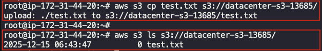

## Task: Managing EC2 Access with S3 Role-based Permissions
The Nautilus DevOps team needs to set up an application on an EC2 instance to interact with an S3 bucket for storing and retrieving data. To achieve this, the team must create a private S3 bucket, set appropriate IAM policies and roles, and test the application functionality.

**Task:**
1. **EC2 Instance Setup:**
    - An instance named `datacenter-ec2` already exists.
    - The instance requires access to an S3 bucket.
2. **Setup SSH Keys:**
    - Create new SSH key pair (id_rsa and id_rsa.pub) on the `aws-client` host and add the public key to the `root` user's authorized keys on the EC2 instance.
3. **Create a Private S3 Bucket:**
    - Name the bucket `datacenter-s3-13685`.
    - Ensure the bucket is private.
4. **Create an IAM Policy and Role:**
    - Create an IAM policy allowing `s3:PutObject`, `s3:ListBucket` and `s3:GetObject` access to `datacenter-s3-13685`.
    - Create an IAM role named `datacenter-role`.
    - Attach the policy to the IAM role.
    - Attach this role to the `datacenter-ec2` instance.
5. **Test the Access:**
    - SSH into the EC2 instance and try to upload a file to `datacenter-s3-13685` bucket using following command:
      `aws s3 cp <your-file> s3://datacenter-s3-13685/`
    - Now run following command to list the upload file:
      `aws s3 ls s3://datacenter-s3-13685/`

---

## Solution

### Step 1: Set Variables
```bash
BUCKET="datacenter-s3-13685"
IAM_ROLE="datacenter-role"
INSTANCE="datacenter-ec2"
```

### Step 2: Create SSH Key on aws-client & Enable Passwordless Access
Create SSH key
```bash
ssh-keygen
```
Copy the public key
```bash
cat /root/.ssh/id_rsa.pub
```

**Note:** Make sure `SSH` access is allowed by the EC2 security group.  
Login to the EC2 instance using **EC2 Instance Connect** from the AWS Management Console.
- On the EC2 instance switch to `root` user:
  ```bash
  sudo su -
  ```
- Add the public key copied earlier from aws-client to `/root/.ssh/authorized_keys` file on the EC2 instance
- Make a note of the EC2 instance public IP while in the AWS management console. We'll use it to `ssh` to it from the `aws-client` host.

### Step 3: Create Private S3 Bucket 
**From the `aws-client` host**
```bash
aws s3api create-bucket \
  --bucket $BUCKET
```
Bucket is private by default.

### Step 4: Create IAM Policy for S3 Access
```bash
cat > s3-policy.json <<EOF
{
  "Version": "2012-10-17",
  "Statement": [
    {
      "Effect": "Allow",
      "Action": [
        "s3:ListBucket"
      ],
      "Resource": "arn:aws:s3:::$BUCKET"
    },
    {
      "Effect": "Allow",
      "Action": [
        "s3:GetObject",
        "s3:PutObject"
      ],
      "Resource": "arn:aws:s3:::$BUCKET/*"
    }
  ]
}
EOF
```
Create IAM Policy
```bash
POLICY_ARN=$(aws iam create-policy \
  --policy-name s3-policy \
  --policy-document file://s3-policy.json \
  --query "Policy.Arn" \
  --output text)
```

### Step 5: Create IAM Role & Attach Policy
Trust policy for EC2
```bash
cat > ec2-trust-policy.json <<EOF
{
  "Version": "2012-10-17",
  "Statement": [
    {
      "Effect": "Allow",
      "Principal": {
        "Service": "ec2.amazonaws.com"
      },
      "Action": "sts:AssumeRole"
    }
  ]
}
EOF
```
Create role
```bash
aws iam create-role \
  --role-name $IAM_ROLE \
  --assume-role-policy-document file://ec2-trust-policy.json
```
Attach policy
```bash
aws iam attach-role-policy \
  --role-name $IAM_ROLE \
  --policy-arn "$POLICY_ARN"
```

### Step 6: Attach IAM Role to EC2 Instance
Create instance profile
```bash
aws iam create-instance-profile \
  --instance-profile-name $IAM_ROLE
```
Add role to instance profile
```bash
aws iam add-role-to-instance-profile \
  --instance-profile-name $IAM_ROLE \
  --role-name $IAM_ROLE
```
Get EC2 instance ID
```bash
INSTANCE_ID=$(aws ec2 describe-instances \
  --filters "Name=tag:Name,Values=$INSTANCE" \
  --query "Reservations[].Instances[].InstanceId" \
  --output text)
```
Attach profile to EC2
```bash
aws ec2 associate-iam-instance-profile \
  --instance-id $INSTANCE_ID \
  --iam-instance-profile Name=$IAM_ROLE
```

**Note:** While using AWS console selecting a role automatically creates & attaches an instance profile behind the scenes. Since we're perfoming the task using AWS CLI, we'll have to create an instance profile → add role to instance profile → attach instance profile to EC2.

### Step 7: Test Access
SSH to the EC2 instance using its public IP
```bash
ssh root@<VM_PUBLIC_IP>
```
Create a test file and upload it to S3 from the EC2 instance
```bash
# create a test file
touch test.txt

# upload to s3 bucket
aws s3 cp test.txt s3://<s3_bucket_name>/

# list the upload file
aws s3 ls s3://<s3_bucket_name>/
```
