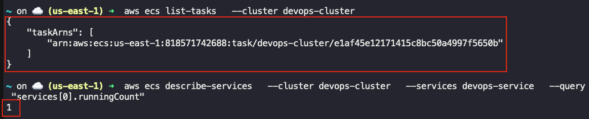

## Task: : Deploying Containerized Applications with Amazon ECS
The Nautilus DevOps team is tasked with deploying a containerized application using Amazon's container services. They need to create a private Amazon Elastic Container Registry (ECR) to store their Docker images and use Amazon Elastic Container Service (ECS) to deploy the application. The process involves building a Docker image from a given Dockerfile, pushing it to the ECR, and then setting up an ECS cluster to run the application.

1. **Create a Private ECR Repository**:
    - Create a private ECR repository named `devops-ecr` to store Docker images.
2. **Build and Push Docker Image**:
    - Use the Dockerfile located at `/root/pyapp` on the `aws-client` host.
    - Build a Docker image using this Dockerfile.
    - Tag the image with `latest` tag.
    - Push the Docker image to the `devops-ecr` repository.
3. **Create and Configure ECS cluster**:
    - Create an ECS cluster named `devops-cluster` using the `Fargate` launch type.
4. **Create an ECS Task Definition**:
    - Define a task named `devops-taskdefinition` using the Docker image from the `devops-ecr` ECR repository.
    - Specify necessary CPU and memory resources.
5. **Deploy the Application Using ECS Service**:
    - Create a service named `devops-service` on the `devops-cluster` to run the task.
    - Ensure the service runs at least one task.

---

## Solution

### Step 1: Set Variables
```bash
ECR_REPO="devops-ecr"
ECS_CLUSTER="devops-cluster"
ECS_SERVICE="devops-service"
TASK_DEF="devops-taskdefinition"
```

### Step 2: Create ECR repository
```bash
ECR_URI=$(aws ecr create-repository \
  --repository-name $ECR_REPO \
  --query "repository.repositoryUri" \
  --output text)
```

### Step 3: Authenticate Docker to ECR
```bash
aws ecr get-login-password | docker login \
  --username AWS \
  --password-stdin "$ECR_URI"
```

### Step 4: Build Docker image
```bash
cd /root/pyapp
docker build -t $ECR_REPO:latest .
```

### Step 5: Tag & Push Image to ECR
```bash
docker tag $ECR_REPO:latest "$ECR_URI:latest"
docker push "$ECR_URI:latest"
```

### Step 6: Create ECS Cluster
```bash
aws ecs create-cluster \
  --cluster-name $ECS_CLUSTER
```

### Step 7: Create IAM Role for ECS Task Execution
Trust policy
```bash
cat > ecs-task-trust.json <<EOF
{
  "Version": "2012-10-17",
  "Statement": [
    {
      "Effect": "Allow",
      "Principal": {
        "Service": "ecs-tasks.amazonaws.com"
      },
      "Action": "sts:AssumeRole"
    }
  ]
}
EOF
```
Create role
```bash
aws iam create-role \
  --role-name ecsTaskExecutionRole \
  --assume-role-policy-document file://ecs-task-trust.json
```
Attach ECS task execution policy
```bash
aws iam attach-role-policy \
  --role-name ecsTaskExecutionRole \
  --policy-arn arn:aws:iam::aws:policy/service-role/AmazonECSTaskExecutionRolePolicy
```
Get Role ARN
```bash
TASK_ROLE_ARN=$(aws iam get-role \
  --role-name ecsTaskExecutionRole \
  --query "Role.Arn" \
  --output text)
```

### Step 8: Create ECS Task Definition
```bash
cat > taskdef.json <<EOF
{
  "family": "$TASK_DEF",
  "networkMode": "awsvpc",
  "requiresCompatibilities": ["FARGATE"],
  "cpu": "256",
  "memory": "512",
  "executionRoleArn": "$TASK_ROLE_ARN",
  "containerDefinitions": [
    {
      "name": "kke-container",
      "image": "$ECR_URI:latest",
      "essential": true,
      "portMappings": [
        {
          "containerPort": 80,
          "protocol": "tcp"
        }
      ]
    }
  ]
}
EOF
```
Register task definition
```bash
aws ecs register-task-definition \
  --cli-input-json file://taskdef.json
```

### Step 9: Create ECS Service
Get default subnets
```bash
SUBNETS=$(aws ec2 describe-subnets \
  --query "Subnets[].SubnetId" \
  --output text)

SUBNETS_CSV=$(echo $SUBNETS | tr ' ' ',')
```
Create security group
```bash
SG_ID=$(aws ec2 create-security-group \
  --group-name ecs-sg \
  --description "Allow HTTP" \
  --vpc-id $(aws ec2 describe-vpcs --query "Vpcs[0].VpcId" --output text) \
  --query "GroupId" \
  --output text)

aws ec2 authorize-security-group-ingress \
  --group-id "$SG_ID" \
  --protocol tcp \
  --port 80 \
  --cidr 0.0.0.0/0
```
Create service
```bash
aws ecs create-service \
  --cluster $ECS_CLUSTER \
  --service-name $ECS_SERVICE \
  --task-definition $TASK_DEF \
  --desired-count 1 \
  --launch-type FARGATE \
  --network-configuration "awsvpcConfiguration={subnets=[$SUBNETS_CSV],securityGroups=[$SG_ID],assignPublicIp=ENABLED}"
```

### Step 10: Validate deployment
Check running tasks
```bash
aws ecs list-tasks \
  --cluster $ECS_CLUSTER
```
Describe service
```bash
aws ecs describe-services \
  --cluster $ECS_CLUSTER \
  --services $ECS_SERVICE \
  --query "services[0].runningCount"
```
