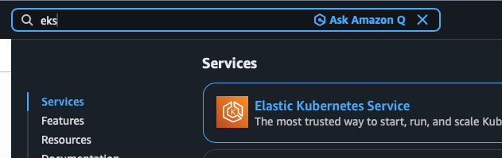
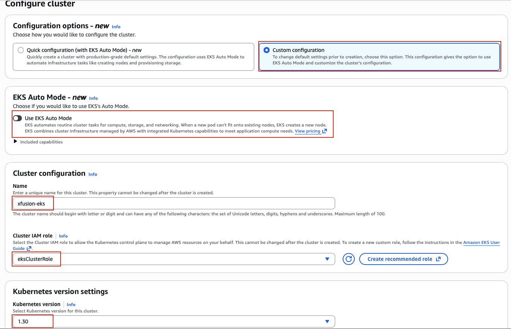
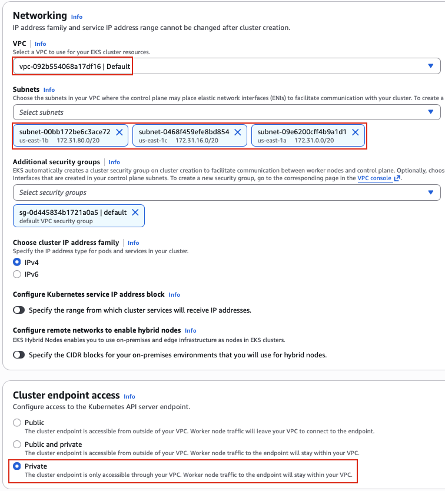
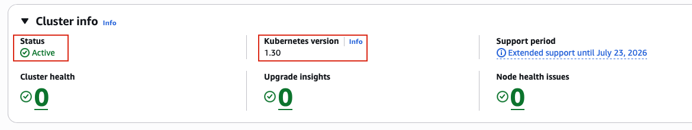

## Task: Scaling and Managing Kubernetes Clusters with Amazon EKS
The Nautilus DevOps team has been tasked with preparing the infrastructure for a new Kubernetes-based application that will be deployed using Amazon EKS. The team is in the process of setting up an EKS cluster that meets their internal security and scalability standards. They require that the cluster be provisioned using the latest stable Kubernetes version to take advantage of new features and security improvements.

To minimize external exposure, the EKS cluster endpoint must be kept private. Additionally, the cluster needs to use the default VPC with availability zones `a`, `b`, and `c` to ensure high availability across different physical locations.

Your task is to create an EKS cluster named `xfusion-eks`, along with an IAM role for the cluster named `eksClusterRole`. The Kubernetes version must be `1.30`. Ensure that the cluster endpoint access is configured as private.

Finally, verify that the EKS cluster is successfully created with the correct configuration and is ready for workloads.

---

## Solution

### Step 1: Set Variables
```bash
IAM_ROLE=eksClusterRole
```

### Step 2: Create an IAM Role for EKS
Trust policy for EKS service
```bash
cat > eks-trust-policy.json <<EOF
{
  "Version": "2012-10-17",
  "Statement": [
    {
      "Effect": "Allow",
      "Principal": {
        "Service": "eks.amazonaws.com"
      },
      "Action": "sts:AssumeRole"
    }
  ]
}
EOF
```
Create role
```bash
aws iam create-role \
    --role-name $IAM_ROLE \
    --assume-role-policy-document file://eks-trust-policy.json
```
Attach the EKS cluster policy
```bash
aws iam attach-role-policy \
    --role-name $IAM_ROLE \
    --policy-arn arn:aws:iam::aws:policy/AmazonEKSClusterPolicy
```

### Step 3: Create the EKS Cluster (from AWS management console)
- Login to the console using the provided credentials.
- Navigate to EKS Service
- Click **Create**  


### Step 4: Configure Cluster
Select the options as per the task description.
- Cluster name: `xfusion-eks`
- Cluster IAM Role: `eksClusterRole`
- Kubernetes version: `1.30`
- Leave other options as default and click **Next**  


### Step 5: Specify Networking
- VPC: `Default`
- Subnets: Select subnets in `a`, `b` and `c` availability zones
- Cluster endpoint access: `Private`  


Leave other options as default.

### Step 6: Review and Create
Review all your settings and click **Create**

### Step 7: Monitor Cluster Creation
- You'll be redirected to the cluster details page
- Look at the `Status` field, wait for it to become `Active`(This will take 10-15 minutes)  
