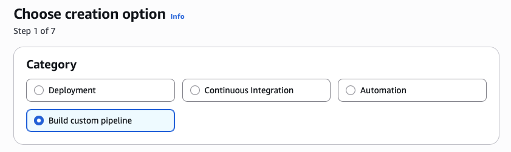
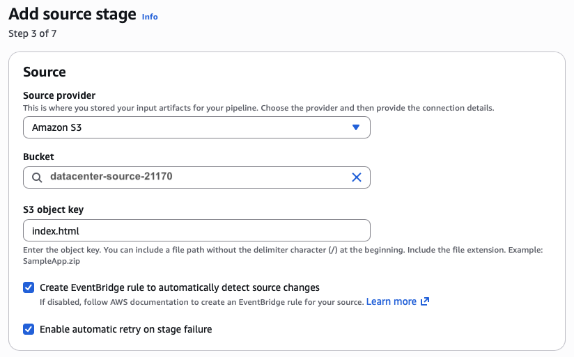
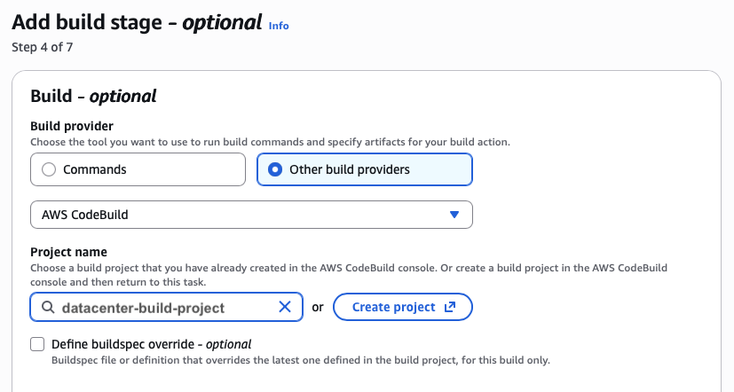

## Task: CI/CD Automation Using AWS CodePipeline
The Nautilus DevOps team is responsible for managing and deploying applications efficiently. They want to streamline their CI/CD process using AWS CodePipeline and AWS S3. Your task is to set up a CI/CD pipeline that automates the deployment of a sample web application on an S3 bucket configured as a static website.

For this task, perform the following steps:
1. There is a bucket named `datacenter-source-21170` which contains a static website source code. Create a new S3 bucket named `datacenter-deployment-31991`. Configure the bucket to serve static website content and ensure the bucket is publicly accessible.
2. Create an AWS CodePipeline named `datacenter-webapp-pipeline` with the following stages:
    - **Source**: Source Provider - AWS S3, Bucket Name - `datacenter-source-21170`.
    - **Build**: Build Provider - AWS CodeBuild, Project Name - `datacenter-build-project`, Environment - Managed image, `aws/codebuild/amazonlinux2-x86_64-standard:4.0`, Linux, and set the Image version to `Always use the latest image` for this runtime version. Insert the necessary build commands in the Build commands section to directly upload the `index.html` file to the S3 bucket.

**Expected Outcome:**
When any changes made to the file `index.html` in `datacenter-source-21170` bucket, the pipeline should automatically build the project using the inserted build commands and deploy the `index.html` file to the `datacenter-deployment-31991` bucket. The S3 bucket should be configured to allow public access, and the website should be accessible via the S3 static website URL.

---

## Solution

### Step 1: Set Variables
```bash
DEST_BUCKET="datacenter-deployment-31991"
```

### Step 2: Create the Deployment S3 Bucket
Create bucket
```bash
aws s3api create-bucket \
  --bucket $DEST_BUCKET
```
Enable static website hosting
```bash
aws s3 website s3://$DEST_BUCKET/ \
  --index-document index.html
```

### Step 3: Make the Bucket Publicly Accessible
Disable block public access
```bash
aws s3api put-public-access-block \
  --bucket $DEST_BUCKET \
  --public-access-block-configuration \
  BlockPublicAcls=false,IgnorePublicAcls=false,BlockPublicPolicy=false,RestrictPublicBuckets=false
```
Create bucket policy file
```bash
cat <<EOF > bucket-policy.json
{
  "Version": "2012-10-17",
  "Statement": [
    {
      "Effect": "Allow",
      "Principal": "*",
      "Action": "s3:GetObject",
      "Resource": "arn:aws:s3:::$DEST_BUCKET/*"
    }
  ]
}
EOF
```
Apply bucket policy for public read access
```bash
aws s3api put-bucket-policy \
  --bucket $DEST_BUCKET \
  --policy file://bucket-policy.json
```

### Step 4: Create CodeBuild Project (from AWS Management console)
Create CodeBuild project as per the task description 
- Make sure codebuild has amazon s3 full access for simplicity (not recommended in production)
- Add build commands to upload `index.html` to the deployment bucket
  ```bash
  version: 0.2

  phases:
    build:
      commands:
        - echo "Deploying index.html to S3 static website bucket"
        - aws s3 cp *.html s3://<deployment_bucket_name>/index.html
  ```

### Step 5: Create CodePipeline
- Select `Build custom pipeline` category  
  
- Enter pipeline settings as per the task description  
- Add Source stage with Amazon s3 as source provider  
  
- Add build stage with AWS codebuild as build provider
- Select previously created codebuild project from dropdown  
  
- Skip other stages and create pipeline